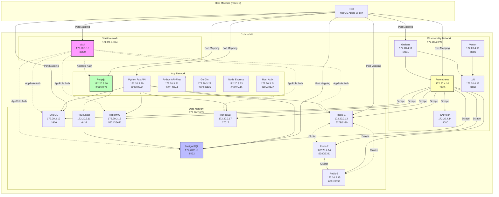
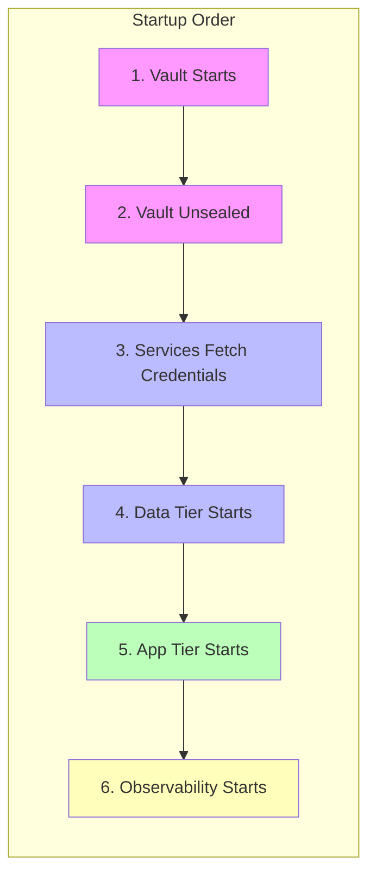
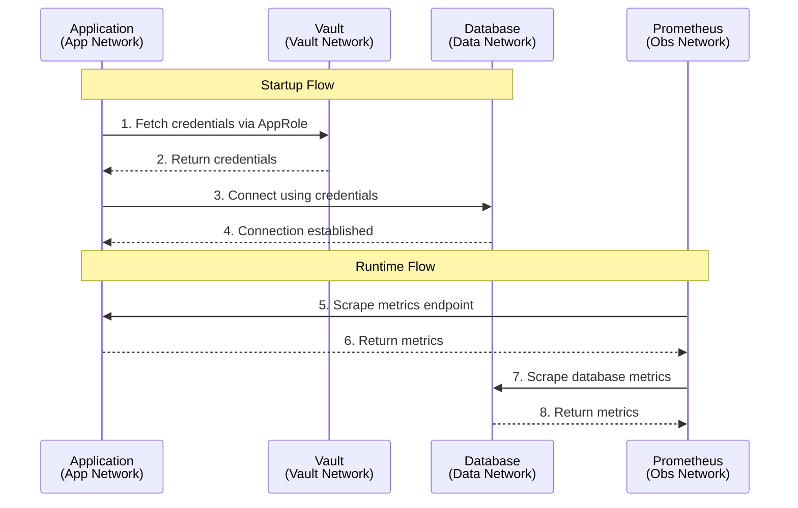
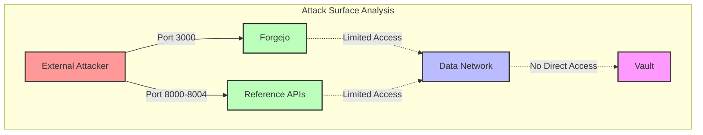

# NETWORK SEGMENTATION

4-tier network architecture isolating Vault, data services, applications, and observability components for enhanced security and traffic control.

**Version:** 1.3.0 | **Last Updated:** 2025-01-18

## Table of Contents

- [Overview](#overview)
- [Network Architecture](#network-architecture)
- [Network Tiers](#network-tiers)
  - [Vault Network (Infrastructure Tier)](#vault-network-infrastructure-tier)
  - [Data Network (Data Tier)](#data-network-data-tier)
  - [App Network (Application Tier)](#app-network-application-tier)
  - [Observability Network (Monitoring Tier)](#observability-network-monitoring-tier)
- [Network Diagram](#network-diagram)
- [Service Placement](#service-placement)
- [Inter-Network Communication](#inter-network-communication)
- [Security Implications](#security-implications)
- [IP Address Allocation](#ip-address-allocation)
- [Firewall Rules](#firewall-rules)
- [Best Practices](#best-practices)
- [Troubleshooting Network Issues](#troubleshooting-network-issues)

---

## Overview

DevStack Core implements **4-tier network segmentation** to provide logical isolation between different categories of services. This architecture follows security best practices by limiting the blast radius of potential security issues and controlling inter-service communication.

**Key Benefits:**
- **Security:** Logical isolation prevents lateral movement
- **Organization:** Services are grouped by function
- **Control:** Fine-grained network access controls
- **Observability:** Clear network boundaries for monitoring
- **Scalability:** Easy to add services to appropriate tiers

**Network Philosophy:**
- All services connect to Vault network for secrets management
- Services only join networks they need access to
- No service needs access to all four networks
- Observability services monitor all tiers without exposing them

---

## Network Architecture

```
┌───────────────────────────────────────────────────────────────────────────┐
│                          DEVSTACK CORE NETWORKS                           │
│                          (4-Tier Segmentation)                            │
└───────────────────────────────────────────────────────────────────────────┘

┌───────────────────────────────────────────────────────────────────────────┐
│  VAULT NETWORK (172.20.1.0/24) - Infrastructure Tier                      │
│                                                                           │
│  ┌─────────────┐                                                          │
│  │    Vault    │ ◄───── All services connect here for secrets             │
│  └─────────────┘                                                          │
│                                                                           │
└───────────────────────────────────────────────────────────────────────────┘
                                    │
                                    │ AppRole Auth
                                    ▼
┌───────────────────────────────────────────────────────────────────────────┐
│  DATA NETWORK (172.20.2.0/24) - Data Tier                                 │
│                                                                           │
│  ┌────────────┐  ┌────────────┐  ┌────────────┐  ┌────────────┐          │
│  │ PostgreSQL │  │   MySQL    │  │  MongoDB   │  │  Redis x3  │          │
│  └────────────┘  └────────────┘  └────────────┘  └────────────┘          │
│                                                                           │
│  ┌────────────┐                                                          │
│  │  RabbitMQ  │                                                          │
│  └────────────┘                                                          │
│                                                                           │
└───────────────────────────────────────────────────────────────────────────┘
                                    │
                                    │ Database Connections
                                    ▼
┌───────────────────────────────────────────────────────────────────────────┐
│  APP NETWORK (172.20.3.0/24) - Application Tier                           │
│                                                                           │
│  ┌─────────────┐  ┌─────────────────────────────────────────────────────┐ │
│  │   Forgejo   │  │  Reference APIs (Python/Go/Node/Rust/TypeScript)    │ │
│  │    (Git)    │  └─────────────────────────────────────────────────────┘ │
│  └─────────────┘                                                          │
│                                                                           │
└───────────────────────────────────────────────────────────────────────────┘
                                    │
                                    │ Metrics & Logs
                                    ▼
┌───────────────────────────────────────────────────────────────────────────┐
│  OBSERVABILITY NETWORK (172.20.4.0/24) - Monitoring Tier                  │
│                                                                           │
│  ┌────────────┐  ┌────────────┐  ┌────────────┐  ┌────────────┐          │
│  │ Prometheus │  │  Grafana   │  │    Loki    │  │   Vector   │          │
│  └────────────┘  └────────────┘  └────────────┘  └────────────┘          │
│                                                                           │
│  ┌────────────┐                                                          │
│  │  cAdvisor  │                                                          │
│  └────────────┘                                                          │
│                                                                           │
└───────────────────────────────────────────────────────────────────────────┘
```

---

## Network Tiers

### Vault Network (Infrastructure Tier)

**Subnet:** `172.20.1.0/24`
**Gateway:** `172.20.1.1`
**Bridge:** `br-vault`

**Purpose:**
Provides centralized secrets management using HashiCorp Vault. All services connect to this network to fetch credentials using AppRole authentication.

**Services:**
- `vault` (172.20.1.10)

**Access Pattern:**
- **All services** connect to this network temporarily during startup
- Services use AppRole authentication to fetch credentials
- No persistent connections after credential retrieval
- Vault is the ONLY service that permanently resides here

**Security:**
- Vault is the single source of truth for credentials
- No hardcoded passwords in any service
- AppRole provides machine authentication
- Network isolation prevents credential leakage

**Configuration:**
```yaml
networks:
  vault-network:
    driver: bridge
    ipam:
      config:
        - subnet: 172.20.1.0/24
          gateway: 172.20.1.1
    driver_opts:
      com.docker.network.bridge.name: br-vault
```

---

### Data Network (Data Tier)

**Subnet:** `172.20.2.0/24`
**Gateway:** `172.20.2.1`
**Bridge:** `br-data`

**Purpose:**
Houses all data storage services including databases, caching, and message queuing. This tier is isolated from application logic to protect data at rest.

**Services:**
| Service | IP Address | Ports | Purpose |
|---------|------------|-------|---------|
| `postgres` | 172.20.2.10 | 5432 | PostgreSQL database (Forgejo + dev) |
| `pgbouncer` | 172.20.2.11 | 6432 | PostgreSQL connection pooling |
| `mysql` | 172.20.2.12 | 3306 | MySQL database |
| `redis-1` | 172.20.2.13 | 6379, 6390, 16379 | Redis node 1 (master) |
| `redis-2` | 172.20.2.14 | 6380, 6391, 16380 | Redis node 2 (master) |
| `redis-3` | 172.20.2.15 | 6381, 6392, 16381 | Redis node 3 (master) |
| `rabbitmq` | 172.20.2.16 | 5672, 5671, 15672 | Message queue + management UI |
| `mongodb` | 172.20.2.17 | 27017 | MongoDB NoSQL database |

**Access Pattern:**
- Only application-tier services can access data-tier
- No direct external access (except via port mapping for development)
- Data services communicate with each other (e.g., PgBouncer → PostgreSQL)
- All services fetch credentials from Vault network

**Security:**
- Data tier isolated from public-facing applications
- Credentials managed by Vault (no hardcoding)
- TLS available for all services (dual-mode: TLS + non-TLS)
- Connection pooling via PgBouncer reduces attack surface

**Configuration:**
```yaml
networks:
  data-network:
    driver: bridge
    ipam:
      config:
        - subnet: 172.20.2.0/24
          gateway: 172.20.2.1
    driver_opts:
      com.docker.network.bridge.name: br-data
```

---

### App Network (Application Tier)

**Subnet:** `172.20.3.0/24`
**Gateway:** `172.20.3.1`
**Bridge:** `br-app`

**Purpose:**
Hosts application services including Git hosting and reference API implementations. This tier interfaces with users while connecting to the data tier for storage.

**Services:**
| Service | IP Address | Ports | Purpose |
|---------|------------|-------|---------|
| `forgejo` | 172.20.3.10 | 3000 (HTTP), 2222 (SSH) | Git server with web UI |
| `reference-api` | 172.20.3.20 | 8000 (HTTP), 8443 (HTTPS) | Python FastAPI (code-first) |
| `reference-api-first` | 172.20.3.21 | 8001 (HTTP), 8444 (HTTPS) | Python FastAPI (API-first) |
| `golang-reference` | 172.20.3.22 | 8002 (HTTP), 8445 (HTTPS) | Go Gin framework |
| `nodejs-reference` | 172.20.3.23 | 8003 (HTTP), 8446 (HTTPS) | Node.js Express |
| `rust-reference` | 172.20.3.24 | 8004 (HTTP), 8447 (HTTPS) | Rust Actix-web (~40%) |

**Access Pattern:**
- Exposed to host via port mapping for user access
- Connect to data-network for database/cache/queue access
- Connect to vault-network for credential retrieval
- No direct access to observability-network

**Security:**
- Public-facing services with authentication
- No direct database access (use PgBouncer for pooling)
- TLS available for all services (dual-mode)
- Reference apps demonstrate secure coding patterns

**Configuration:**
```yaml
networks:
  app-network:
    driver: bridge
    ipam:
      config:
        - subnet: 172.20.3.0/24
          gateway: 172.20.3.1
    driver_opts:
      com.docker.network.bridge.name: br-app
```

---

### Observability Network (Monitoring Tier)

**Subnet:** `172.20.4.0/24`
**Gateway:** `172.20.4.1`
**Bridge:** `br-obs`

**Purpose:**
Provides monitoring, metrics collection, logging, and visualization for all services. This tier monitors other networks without exposing them.

**Services:**
| Service | IP Address | Ports | Purpose |
|---------|------------|-------|---------|
| `prometheus` | 172.20.4.10 | 9090 | Metrics collection and queries |
| `grafana` | 172.20.4.11 | 3001 | Metrics visualization |
| `loki` | 172.20.4.12 | 3100 | Log aggregation |
| `vector` | 172.20.4.13 | 8686 | Log shipping pipeline |
| `cadvisor` | 172.20.4.14 | 8080 | Container metrics |
| `redis-exporter-1` | 172.20.4.20 | 9121 | Redis node 1 metrics |
| `redis-exporter-2` | 172.20.4.21 | 9122 | Redis node 2 metrics |
| `redis-exporter-3` | 172.20.4.22 | 9123 | Redis node 3 metrics |

**Access Pattern:**
- Prometheus scrapes metrics from all services across all networks
- Loki aggregates logs via Vector pipeline
- Grafana visualizes data from Prometheus and Loki
- No inbound connections from other tiers (monitoring only)

**Security:**
- Read-only access to monitored services
- No credential storage (uses Vault for datasource credentials)
- Isolated from application and data tiers
- Grafana requires authentication (admin/admin default)

**Configuration:**
```yaml
networks:
  observability-network:
    driver: bridge
    ipam:
      config:
        - subnet: 172.20.4.0/24
          gateway: 172.20.4.1
    driver_opts:
      com.docker.network.bridge.name: br-obs
```

---

## Network Diagram

### Complete Network Topology



### Service Dependencies Flow



---

## Service Placement

### Network Membership Matrix

| Service | Vault Network | Data Network | App Network | Observability Network |
|---------|--------------|--------------|-------------|----------------------|
| **Vault** | ✅ Primary | ❌ | ❌ | ❌ |
| **PostgreSQL** | ✅ Auth | ✅ Primary | ❌ | ❌ |
| **PgBouncer** | ✅ Auth | ✅ Primary | ❌ | ❌ |
| **MySQL** | ✅ Auth | ✅ Primary | ❌ | ❌ |
| **Redis (1-3)** | ✅ Auth | ✅ Primary | ❌ | ❌ |
| **RabbitMQ** | ✅ Auth | ✅ Primary | ❌ | ❌ |
| **MongoDB** | ✅ Auth | ✅ Primary | ❌ | ❌ |
| **Forgejo** | ✅ Auth | ✅ Database | ✅ Primary | ❌ |
| **Reference APIs** | ✅ Auth | ✅ Database | ✅ Primary | ❌ |
| **Prometheus** | ❌ | ✅ Scrape | ✅ Scrape | ✅ Primary |
| **Grafana** | ❌ | ❌ | ❌ | ✅ Primary |
| **Loki** | ❌ | ❌ | ❌ | ✅ Primary |
| **Vector** | ❌ | ❌ | ❌ | ✅ Primary |
| **cAdvisor** | ❌ | ❌ | ❌ | ✅ Primary |
| **Redis Exporters** | ❌ | ✅ Scrape | ❌ | ✅ Primary |

**Legend:**
- ✅ **Primary:** Service permanently resides in this network
- ✅ **Auth:** Connects during startup for Vault AppRole authentication
- ✅ **Database:** Connects for data storage/retrieval
- ✅ **Scrape:** Connects to collect metrics/logs
- ❌ **Not Connected**

---

## Inter-Network Communication

### Communication Patterns



### Allowed Traffic Flows

| Source Network | Destination Network | Purpose | Protocol | Ports |
|----------------|---------------------|---------|----------|-------|
| **All** | **Vault** | Credential retrieval | HTTP | 8200 |
| **App** | **Data** | Database queries | TCP | 5432, 3306, 27017, 6379-6381 |
| **App** | **Data** | Cache access | TCP | 6379-6381, 6390-6392 |
| **App** | **Data** | Message queue | TCP | 5672, 5671 |
| **Observability** | **All** | Metrics scraping | HTTP | 9090, 9121-9123, etc. |
| **Observability** | **All** | Log collection | TCP | 8686 |
| **Host** | **All** | Port-mapped access | Various | Various |

### Blocked Traffic Flows

| Source Network | Destination Network | Reason |
|----------------|---------------------|--------|
| **Data** | **App** | Data tier should not initiate to app tier |
| **Data** | **Observability** | Data tier should not send metrics (pull only) |
| **App** | **Observability** | Apps expose metrics, don't push |
| **Observability** | **Vault** | No secrets needed for monitoring |

---

## Security Implications

### Defense in Depth

1. **Network Isolation:**
   - Services can't access networks they don't need
   - Limits lateral movement in case of compromise
   - Clear security boundaries

2. **Vault-First Credential Management:**
   - No hardcoded credentials anywhere
   - AppRole provides machine authentication
   - Credentials rotated centrally via Vault

3. **Least Privilege:**
   - Services only join networks they require
   - No service has access to all four networks
   - Monitoring is read-only (pull-based)

4. **TLS Support (Dual-Mode):**
   - All services support TLS for encrypted transit
   - Development mode allows non-TLS for ease of use
   - Production deployments should enforce TLS-only

### Attack Surface Reduction



**Key Points:**
- External attackers face Forgejo and reference APIs only
- Compromised app service has limited data network access
- Data services are not directly exposed
- Vault credentials are temporary and scoped

---

## IP Address Allocation

### IP Address Ranges

| Network | Subnet | Gateway | Usable IPs | Reserved | Available |
|---------|--------|---------|------------|----------|-----------|
| **Vault** | 172.20.1.0/24 | 172.20.1.1 | 172.20.1.2 - 172.20.1.254 | 172.20.1.10 | 243 |
| **Data** | 172.20.2.0/24 | 172.20.2.1 | 172.20.2.2 - 172.20.2.254 | 172.20.2.10-17 | 245 |
| **App** | 172.20.3.0/24 | 172.20.3.1 | 172.20.3.2 - 172.20.3.254 | 172.20.3.10-24 | 238 |
| **Observability** | 172.20.4.0/24 | 172.20.4.1 | 172.20.4.2 - 172.20.4.254 | 172.20.4.10-22 | 240 |

### Static IP Assignments

See [Service Placement](#service-placement) section for complete static IP mapping.

**IP Assignment Strategy:**
- Core services: `.10` - `.19`
- Additional services: `.20` - `.29`
- Future expansion: `.30` - `.254`
- Gateway always: `.1`
- Broadcast always: `.255`

---

## Firewall Rules

### Docker Bridge Firewall (iptables)

Docker automatically creates iptables rules for bridge networks. Here's what happens:

**Default Rules:**
```bash
# Allow inter-container communication within same network
iptables -A DOCKER-ISOLATION-STAGE-2 -o br-vault -j ACCEPT
iptables -A DOCKER-ISOLATION-STAGE-2 -o br-data -j ACCEPT
iptables -A DOCKER-ISOLATION-STAGE-2 -o br-app -j ACCEPT
iptables -A DOCKER-ISOLATION-STAGE-2 -o br-obs -j ACCEPT

# Block traffic between different bridge networks
iptables -A DOCKER-ISOLATION-STAGE-1 -i br-vault -o br-data -j DROP
iptables -A DOCKER-ISOLATION-STAGE-1 -i br-vault -o br-app -j DROP
iptables -A DOCKER-ISOLATION-STAGE-1 -i br-vault -o br-obs -j DROP
# (and so on for all network pairs)
```

**Custom Rules (if needed):**
```bash
# View current Docker iptables rules
sudo iptables -L DOCKER-USER -n -v

# Example: Block specific port from app to data
sudo iptables -I DOCKER-USER -i br-app -o br-data -p tcp --dport 27017 -j DROP

# Example: Allow only PostgreSQL from app to data
sudo iptables -I DOCKER-USER -i br-app -o br-data -p tcp --dport 5432 -j ACCEPT
sudo iptables -A DOCKER-USER -i br-app -o br-data -j DROP
```

**⚠️ Warning:** Custom iptables rules are not persistent across Docker restarts. Use Docker network policies or external tools for persistent rules.

---

## Best Practices

### Development Environment

1. **Use Default Configuration:**
   - 4-tier segmentation is already configured
   - Services are assigned to correct networks
   - No manual network configuration needed

2. **Port Mapping for Access:**
   - Access services via `localhost:PORT` from host
   - Don't expose unnecessary ports
   - Use service-to-service communication within networks

3. **Credential Management:**
   - Always use Vault for credentials
   - Never hardcode passwords in config files
   - Use AppRole for service authentication

4. **TLS Configuration:**
   - Development: Dual-mode (TLS + non-TLS) for flexibility
   - Testing: TLS-only mode to catch issues early
   - Production: TLS-only with certificate validation

### Production Environment

1. **Enforce TLS:**
   ```bash
   # Set in .env
   POSTGRES_ENABLE_TLS=true
   MYSQL_ENABLE_TLS=true
   MONGODB_ENABLE_TLS=true
   RABBITMQ_ENABLE_TLS=true
   REDIS_TLS_ENABLED=true
   VAULT_ENABLE_TLS=true
   ```

2. **Network Policies:**
   - Implement Kubernetes NetworkPolicies if using K8s
   - Use service mesh (Istio, Linkerd) for advanced control
   - Enable Docker user-defined bridge encryption

3. **Monitoring:**
   - Monitor network traffic patterns
   - Alert on unusual inter-network communication
   - Track connection failures and retries

4. **Least Privilege:**
   - Remove services from networks they don't need
   - Use read-only database accounts where possible
   - Implement network access control lists (ACLs)

---

## Troubleshooting Network Issues

### Common Issues

#### 1. Service Can't Reach Vault

**Symptoms:**
```
Error: Error making API request.
URL: http://vault:8200/v1/auth/approle/login
```

**Diagnosis:**
```bash
# Check if service is on vault-network
docker inspect <service-name> | grep -A 10 Networks

# Test connectivity from service
docker exec <service-name> ping -c 3 vault
docker exec <service-name> curl -v http://vault:8200/v1/sys/health
```

**Solution:**
- Verify service has `vault-network` in `docker-compose.yml`
- Ensure Vault is healthy: `docker ps | grep vault`
- Check Vault logs: `./devstack logs vault`

#### 2. App Can't Connect to Database

**Symptoms:**
```
connection to server at "postgres" (172.20.2.10), port 5432 failed
```

**Diagnosis:**
```bash
# Check if app is on data-network
docker inspect reference-api | grep -A 10 Networks

# Test database connectivity
docker exec reference-api ping -c 3 postgres
docker exec reference-api nc -zv postgres 5432
```

**Solution:**
- Verify app has `data-network` in `docker-compose.yml`
- Check database is running: `docker ps | grep postgres`
- Verify credentials from Vault: `./devstack vault-show-password postgres`

#### 3. Prometheus Can't Scrape Metrics

**Symptoms:**
```
Get "http://postgres:9187/metrics": dial tcp: lookup postgres: no such host
```

**Diagnosis:**
```bash
# Check Prometheus network membership
docker inspect prometheus | grep -A 20 Networks

# Test connectivity
docker exec prometheus ping -c 3 postgres
```

**Solution:**
- Prometheus must be on same network as target
- Add target's network to Prometheus service definition
- Verify target exposes metrics endpoint: `curl http://localhost:9187/metrics`

#### 4. Network Bridge Not Created

**Symptoms:**
```
ERROR: Network vault-network declared as external, but could not be found
```

**Diagnosis:**
```bash
# List Docker networks
docker network ls | grep br-

# Inspect specific network
docker network inspect vault-network
```

**Solution:**
```bash
# Recreate network
docker network rm vault-network
docker compose up -d

# Or remove all networks and recreate
docker compose down
docker network prune -f
docker compose up -d
```

### Diagnostic Commands

```bash
# View all networks
docker network ls

# Inspect network details
docker network inspect vault-network
docker network inspect data-network
docker network inspect app-network
docker network inspect observability-network

# View service network membership
docker inspect --format='{{json .NetworkSettings.Networks}}' <service-name> | jq

# Test connectivity between services
docker exec <service-a> ping -c 3 <service-b>
docker exec <service-a> nc -zv <service-b> <port>
docker exec <service-a> curl -v http://<service-b>:<port>/health

# View iptables rules for Docker
sudo iptables -L DOCKER-USER -n -v
sudo iptables -L DOCKER-ISOLATION-STAGE-1 -n -v
sudo iptables -L DOCKER-ISOLATION-STAGE-2 -n -v

# Monitor network traffic (requires tcpdump in container)
docker exec <service-name> tcpdump -i eth0 -n
```

### Network Reset Procedure

If networks are corrupted or misconfigured:

```bash
# 1. Stop all services
./devstack stop

# 2. Remove all networks
docker network prune -f

# 3. Optionally remove specific networks
docker network rm vault-network data-network app-network observability-network

# 4. Restart services (networks recreated automatically)
./devstack start --profile standard

# 5. Verify networks
docker network ls
./devstack health
```

---

## See Also

- [ARCHITECTURE.md](./ARCHITECTURE.md) - Complete system architecture
- [SERVICES.md](./SERVICES.md) - Service-specific configuration
- [SECURITY_ASSESSMENT.md](./SECURITY_ASSESSMENT.md) - Security analysis
- [TROUBLESHOOTING.md](./TROUBLESHOOTING.md) - General troubleshooting
- [VAULT.md](./VAULT.md) - Vault PKI and AppRole authentication
- [docker-compose.yml](../docker-compose.yml) - Network definitions

---

**Last Updated:** 2025-01-18
**Version:** 1.3.0
