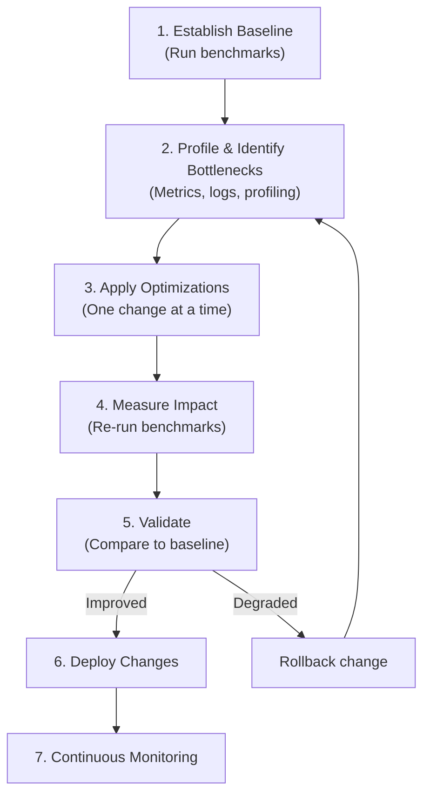
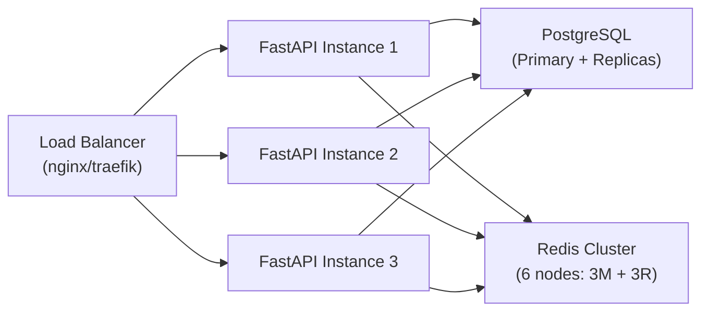

# Performance Tuning Guide

Comprehensive guide for optimizing the DevStack Core infrastructure for development and production workloads.

---

## Table of Contents

1. [Overview](#overview)
2. [Resource Allocation](#resource-allocation)
3. [Database Performance](#database-performance)
4. [Redis Cluster Optimization](#redis-cluster-optimization)
5. [API Performance](#api-performance)
6. [Network Performance](#network-performance)
7. [Observability Stack](#observability-stack)
8. [Benchmarking](#benchmarking)
9. [Production Considerations](#production-considerations)

---

## Overview

### Current Performance Baseline

Based on comprehensive testing (see [PERFORMANCE_BASELINE.md](./PERFORMANCE_BASELINE.md)):

| Service | Response Time | Threshold | Status |
|---------|--------------|-----------|--------|
| Vault API | 12ms | <200ms | ✅ Excellent |
| FastAPI | 13ms | <500ms | ✅ Excellent |
| Redis | 140ms | <500ms | ✅ Good |
| RabbitMQ | 120ms | <1000ms | ✅ Good |
| PostgreSQL | 125ms | <1000ms | ✅ Good |
| MySQL | 160ms | <1000ms | ✅ Good |
| MongoDB | 664ms | <1000ms | ⚠️ Acceptable |

### Performance Optimization Flow



---

## Resource Allocation

### Colima VM Optimization

**Default configuration:**
```bash
# ~/.colima/default/colima.yaml
cpu: 4
memory: 8
disk: 60
```

**Recommended for development (23 services):**
```bash
# For smooth development experience
COLIMA_CPU=6 COLIMA_MEMORY=12 COLIMA_DISK=100 ./devstack.sh start
```

**Recommended for heavy workloads:**
```bash
# For load testing, many concurrent users
COLIMA_CPU=8 COLIMA_MEMORY=16 COLIMA_DISK=100 ./devstack.sh start
```

**Monitoring Colima resources:**
```bash
# Check current allocation
colima status

# Monitor VM resource usage
docker stats --no-stream
```

---

### Per-Service Resource Limits

Add resource limits to prevent any single service from consuming all resources:

```yaml
# docker-compose.yml
services:
  postgres:
    deploy:
      resources:
        limits:
          cpus: '2'
          memory: 2G
        reservations:
          cpus: '1'
          memory: 1G

  mongodb:
    deploy:
      resources:
        limits:
          cpus: '2'
          memory: 2G
        reservations:
          cpus: '0.5'
          memory: 512M

  redis-1:
    deploy:
      resources:
        limits:
          cpus: '1'
          memory: 512M
        reservations:
          cpus: '0.25'
          memory: 256M
```

**Apply changes:**
```bash
docker compose up -d --force-recreate
```

---

### Volume Performance

**Use appropriate volume drivers:**

1. **For databases (high I/O):**
```yaml
volumes:
  postgres_data:
    driver: local
    driver_opts:
      type: none
      o: bind
      device: /Users/$USER/.colima/postgres_data
```

2. **For logs (less critical):**
```yaml
volumes:
  loki_data:
    driver: local
```

**Monitor volume performance:**
```bash
# Check volume usage
docker system df -v

# Monitor I/O
docker stats --format "table {{.Name}}\t{{.BlockIO}}"
```

---

## Database Performance

### PostgreSQL Optimization

#### Connection Pooling

**Using PgBouncer (already included):**
```bash
# Connect via PgBouncer instead of direct
psql -h localhost -p 6432 -U dev_admin dev_database
```

**PgBouncer configuration tuning:**
```ini
# configs/pgbouncer/pgbouncer.ini

[pgbouncer]
pool_mode = transaction        # or session for long transactions
max_client_conn = 200          # Increase for high concurrency
default_pool_size = 25         # Connections per user/db
min_pool_size = 5              # Keep warm connections
reserve_pool_size = 5          # Emergency connections
reserve_pool_timeout = 3       # Seconds to wait for connection
```

**Restart PgBouncer after changes:**
```bash
docker compose restart pgbouncer
```

#### PostgreSQL Configuration

**Optimize postgresql.conf:**
```bash
# configs/postgres/postgresql.conf

# Memory settings (adjust based on available RAM)
shared_buffers = 2GB                    # 25% of total RAM
effective_cache_size = 6GB              # 75% of total RAM
work_mem = 64MB                         # Per-query workspace
maintenance_work_mem = 512MB            # For VACUUM, CREATE INDEX

# Connection settings
max_connections = 200                   # Must be > PgBouncer max_client_conn

# WAL settings
wal_buffers = 16MB
checkpoint_completion_target = 0.9
max_wal_size = 2GB
min_wal_size = 1GB

# Query planner
random_page_cost = 1.1                  # For SSD storage
effective_io_concurrency = 200          # For SSD

# Logging (for performance analysis)
log_min_duration_statement = 1000       # Log queries > 1s
log_line_prefix = '%t [%p]: [%l-1] user=%u,db=%d,app=%a,client=%h '
log_statement = 'mod'                   # Log all modifications
log_lock_waits = on
```

**Apply changes:**
```bash
docker compose restart postgres
```

#### Query Optimization

**Enable pg_stat_statements:**
```sql
-- In PostgreSQL
CREATE EXTENSION IF NOT EXISTS pg_stat_statements;

-- Find slow queries
SELECT
  query,
  calls,
  total_time,
  mean_time,
  max_time
FROM pg_stat_statements
ORDER BY total_time DESC
LIMIT 20;
```

**Add indexes:**
```sql
-- Example: Index frequently queried columns
CREATE INDEX idx_users_email ON users(email);
CREATE INDEX idx_orders_user_id ON orders(user_id);
CREATE INDEX idx_orders_created_at ON orders(created_at);

-- Composite indexes for common queries
CREATE INDEX idx_orders_user_created ON orders(user_id, created_at);
```

**Analyze query plans:**
```sql
EXPLAIN ANALYZE SELECT * FROM orders WHERE user_id = 123;
```

---

### MySQL Optimization

#### Configuration Tuning

**Optimize my.cnf:**
```ini
# configs/mysql/my.cnf

[mysqld]
# Memory settings
innodb_buffer_pool_size = 2G           # 70% of available RAM
innodb_log_file_size = 512M
innodb_log_buffer_size = 16M

# Connection settings
max_connections = 200
thread_cache_size = 50
table_open_cache = 4000

# InnoDB settings
innodb_flush_log_at_trx_commit = 2     # Better performance, small data loss risk
innodb_flush_method = O_DIRECT
innodb_file_per_table = 1
innodb_stats_on_metadata = 0

# Query cache (MySQL 5.7)
query_cache_type = 1
query_cache_size = 256M
query_cache_limit = 2M

# Slow query log
slow_query_log = 1
slow_query_log_file = /var/log/mysql/slow.log
long_query_time = 2
log_queries_not_using_indexes = 1
```

**Apply changes:**
```bash
docker compose restart mysql
```

#### Performance Analysis

**Check slow queries:**
```bash
docker exec dev-mysql-1 mysqldumpslow /var/log/mysql/slow.log
```

**Monitor performance schema:**
```sql
-- Top 10 slow queries
SELECT
  DIGEST_TEXT,
  COUNT_STAR,
  AVG_TIMER_WAIT/1000000000000 as avg_time_sec,
  MAX_TIMER_WAIT/1000000000000 as max_time_sec
FROM performance_schema.events_statements_summary_by_digest
ORDER BY AVG_TIMER_WAIT DESC
LIMIT 10;
```

---

### MongoDB Optimization

#### Configuration Tuning

**Optimize mongod.conf:**
```yaml
# configs/mongodb/mongod.conf

storage:
  wiredTiger:
    engineConfig:
      cacheSizeGB: 2                   # 50% of available RAM
      journalCompressor: snappy
    collectionConfig:
      blockCompressor: snappy
    indexConfig:
      prefixCompression: true

operationProfiling:
  mode: slowOp
  slowOpThresholdMs: 100               # Profile queries > 100ms

net:
  maxIncomingConnections: 200
```

**Apply changes:**
```bash
docker compose restart mongodb
```

#### Indexing Strategy

**Create indexes for common queries:**
```javascript
// In mongosh
db.users.createIndex({ email: 1 }, { unique: true })
db.orders.createIndex({ userId: 1, createdAt: -1 })
db.products.createIndex({ category: 1, price: 1 })

// Compound index for specific query pattern
db.orders.createIndex({ status: 1, userId: 1, createdAt: -1 })
```

**Monitor index usage:**
```javascript
// Check index usage stats
db.orders.aggregate([
  { $indexStats: {} }
])

// Find queries not using indexes
db.system.profile.find({
  ns: "dev_database.orders",
  "planSummary": { $ne: "IXSCAN" }
}).pretty()
```

**Optimize queries:**
```javascript
// Use explain to analyze
db.orders.find({ userId: 123 }).explain("executionStats")
```

---

## Redis Cluster Optimization

### Configuration Tuning

**Optimize redis.conf:**
```conf
# configs/redis/redis.conf

# Memory management
maxmemory 512mb
maxmemory-policy allkeys-lru           # Evict least recently used

# Persistence (adjust based on durability needs)
save 900 1                             # Save after 900s if 1 key changed
save 300 10                            # Save after 300s if 10 keys changed
save 60 10000                          # Save after 60s if 10000 keys changed

# For better performance, reduce persistence:
# save ""                              # Disable RDB snapshots
# appendonly no                        # Disable AOF

# AOF settings (if enabled)
appendonly yes
appendfsync everysec                   # Good balance
no-appendfsync-on-rewrite yes

# Replication (for production)
# min-replicas-to-write 1
# min-replicas-max-lag 10

# Performance
tcp-backlog 511
timeout 300
tcp-keepalive 60
```

**Apply changes:**
```bash
docker compose restart redis-1 redis-2 redis-3
```

### Cluster Performance

**Monitor cluster performance:**
```bash
# Cluster stats
docker exec dev-redis-1 redis-cli -a <password> --cluster info 172.20.0.13:6379

# Per-node stats
for node in redis-1 redis-2 redis-3; do
  echo "=== $node ==="
  docker exec dev-$node-1 redis-cli -a <password> info stats | grep -E "total_commands_processed|instantaneous_ops_per_sec"
done
```

**Optimize slot distribution:**
```bash
# Check slot distribution
docker exec dev-redis-1 redis-cli -a <password> cluster nodes

# Rebalance if needed
docker exec dev-redis-1 redis-cli -a <password> --cluster rebalance 172.20.0.13:6379
```

### Connection Pooling

**Use connection pooling in applications:**

**Python example:**
```python
from redis.cluster import RedisCluster
from redis.connection import ConnectionPool

pool = ConnectionPool(
    host='172.20.0.13',
    port=6379,
    password='...',
    max_connections=50,
    socket_keepalive=True,
    socket_keepalive_options={
        socket.TCP_KEEPIDLE: 1,
        socket.TCP_KEEPINTVL: 1,
        socket.TCP_KEEPCNT: 5
    }
)

redis_client = RedisCluster(connection_pool=pool)
```

---

## API Performance

### FastAPI Optimization

#### Connection Pooling

**Optimize database connection pools:**
```python
# reference-apps/fastapi/app/database.py

from sqlalchemy import create_engine
from sqlalchemy.pool import QueuePool

engine = create_engine(
    DATABASE_URL,
    poolclass=QueuePool,
    pool_size=20,              # Connections to keep open
    max_overflow=10,           # Additional connections during peak
    pool_timeout=30,           # Wait 30s for connection
    pool_recycle=3600,         # Recycle connections every hour
    pool_pre_ping=True,        # Verify connection before use
    echo_pool=False,           # Disable pool logging (performance)
)
```

#### Async Optimization

**Use async database access:**
```python
# reference-apps/fastapi/app/database.py

from sqlalchemy.ext.asyncio import create_async_engine, AsyncSession

async_engine = create_async_engine(
    ASYNC_DATABASE_URL,
    pool_size=20,
    max_overflow=10,
    echo=False,
)

# In endpoints
@app.get("/users/{user_id}")
async def get_user(user_id: int, db: AsyncSession = Depends(get_db)):
    result = await db.execute(select(User).filter(User.id == user_id))
    return result.scalars().first()
```

#### Caching Strategy

**Implement multi-level caching:**

```python
from functools import lru_cache
from redis.asyncio import Redis
import pickle

# 1. In-memory cache (fastest)
@lru_cache(maxsize=1000)
def get_config(key: str):
    return fetch_config_from_db(key)

# 2. Redis cache (shared across instances)
redis = Redis(host='172.20.0.13', port=6379, decode_responses=True)

async def get_user_cached(user_id: int):
    # Try cache first
    cached = await redis.get(f"user:{user_id}")
    if cached:
        return pickle.loads(cached)

    # Fetch from DB
    user = await fetch_user_from_db(user_id)

    # Store in cache (TTL: 5 minutes)
    await redis.setex(
        f"user:{user_id}",
        300,
        pickle.dumps(user)
    )

    return user
```

#### Response Compression

**Enable gzip compression:**
```python
# reference-apps/fastapi/main.py

from fastapi.middleware.gzip import GZipMiddleware

app.add_middleware(GZipMiddleware, minimum_size=1000)
```

#### Background Tasks

**Offload heavy work to background:**
```python
from fastapi import BackgroundTasks

@app.post("/process-data")
async def process_data(data: dict, background_tasks: BackgroundTasks):
    # Return immediately
    background_tasks.add_task(heavy_processing, data)
    return {"status": "processing"}

async def heavy_processing(data):
    # This runs in background
    pass
```

---

### Go API Optimization

#### Connection Pooling

**Optimize database pools:**
```go
// reference-apps/golang/internal/database/postgres.go

db, err := sql.Open("postgres", connStr)

// Connection pool settings
db.SetMaxOpenConns(25)              // Maximum open connections
db.SetMaxIdleConns(5)               // Idle connections to keep
db.SetConnMaxLifetime(5 * time.Minute)  // Max connection lifetime
db.SetConnMaxIdleTime(1 * time.Minute)  // Max idle time
```

#### Concurrency

**Use goroutines for parallel operations:**
```go
func GetAllData(ctx context.Context) (*Response, error) {
    var wg sync.WaitGroup
    errChan := make(chan error, 3)

    var users []User
    var orders []Order
    var products []Product

    // Fetch users
    wg.Add(1)
    go func() {
        defer wg.Done()
        var err error
        users, err = fetchUsers(ctx)
        if err != nil {
            errChan <- err
        }
    }()

    // Fetch orders
    wg.Add(1)
    go func() {
        defer wg.Done()
        var err error
        orders, err = fetchOrders(ctx)
        if err != nil {
            errChan <- err
        }
    }()

    // Fetch products
    wg.Add(1)
    go func() {
        defer wg.Done()
        var err error
        products, err = fetchProducts(ctx)
        if err != nil {
            errChan <- err
        }
    }()

    wg.Wait()
    close(errChan)

    // Check for errors
    for err := range errChan {
        return nil, err
    }

    return &Response{Users: users, Orders: orders, Products: products}, nil
}
```

#### Response Caching

**Use in-memory cache:**
```go
import (
    "github.com/patrickmn/go-cache"
    "time"
)

var memCache = cache.New(5*time.Minute, 10*time.Minute)

func GetUser(userID int) (*User, error) {
    // Try cache
    if x, found := memCache.Get(fmt.Sprintf("user:%d", userID)); found {
        return x.(*User), nil
    }

    // Fetch from DB
    user, err := fetchUserFromDB(userID)
    if err != nil {
        return nil, err
    }

    // Store in cache
    memCache.Set(fmt.Sprintf("user:%d", userID), user, cache.DefaultExpiration)

    return user, nil
}
```

---

## Network Performance

### Docker Network Optimization

**Use host network for high-throughput services (with caution):**
```yaml
# Only for non-conflicting services
services:
  prometheus:
    network_mode: host
```

**Optimize network driver:**
```bash
# Check current driver
docker network inspect dev-services --format='{{.Driver}}'

# For better performance, ensure using bridge driver
```

### Port Mapping Optimization

**Minimize port mapping overhead:**
```yaml
# Instead of mapping all Redis ports:
ports:
  - "6379:6379"
  - "6380:6380"
  - "6381:6381"
  - "6390:6390"
  - "6391:6391"
  - "6392:6392"

# Only map what's needed externally
ports:
  - "6379:6379"
```

---

## Observability Stack

### Prometheus Optimization

**Reduce scrape frequency for non-critical metrics:**
```yaml
# configs/prometheus/prometheus.yml

scrape_configs:
  - job_name: 'high-priority'
    scrape_interval: 15s          # Critical services
    static_configs:
      - targets: ['reference-api:8000', 'vault:8200']

  - job_name: 'medium-priority'
    scrape_interval: 30s          # Standard services
    static_configs:
      - targets: ['postgres:5432', 'redis-exporter-1:9121']

  - job_name: 'low-priority'
    scrape_interval: 60s          # Infrastructure
    static_configs:
      - targets: ['cadvisor:8080']
```

**Optimize retention:**
```yaml
# configs/prometheus/prometheus.yml

global:
  scrape_interval: 15s
  evaluation_interval: 15s

# Storage settings
storage:
  tsdb:
    retention.time: 7d            # Keep 7 days (reduce for less disk usage)
    retention.size: 10GB          # Max storage
```

---

### Grafana Optimization

**Reduce dashboard refresh rate:**
```json
{
  "refresh": "30s",               // Instead of "5s"
  "time": {
    "from": "now-1h",             // Shorter time range
    "to": "now"
  }
}
```

**Use query caching:**
```ini
# configs/grafana/grafana.ini

[caching]
enabled = true

[query_caching]
enabled = true
```

---

### Loki Optimization

**Reduce log retention:**
```yaml
# configs/loki/loki.yaml

limits_config:
  retention_period: 168h          # 7 days

table_manager:
  retention_deletes_enabled: true
  retention_period: 168h
```

**Optimize chunk encoding:**
```yaml
# configs/loki/loki.yaml

chunk_store_config:
  max_look_back_period: 168h

schema_config:
  configs:
    - from: 2024-01-01
      store: boltdb-shipper
      object_store: filesystem
      schema: v11
      index:
        prefix: loki_index_
        period: 24h              # Daily indexes
```

---

## Benchmarking

### Infrastructure Benchmarks

**Database performance:**
```bash
# PostgreSQL benchmark
docker exec dev-postgres-1 pgbench -i -s 50 dev_database
docker exec dev-postgres-1 pgbench -c 10 -j 2 -t 1000 dev_database

# Expected results:
# tps = 2000-3000 (excluding connections)
```

**Redis benchmark:**
```bash
# Redis cluster benchmark
docker exec dev-redis-1 redis-cli -a <password> --cluster call 172.20.0.13:6379 debug segfault
docker exec dev-redis-1 redis-benchmark -h 172.20.0.13 -p 6379 -a <password> -t set,get -n 100000 -q

# Expected results:
# SET: 50000-80000 requests/sec
# GET: 60000-100000 requests/sec
```

---

### API Benchmarks

**Using Apache Bench:**
```bash
# Health check endpoint
ab -n 1000 -c 10 http://localhost:8000/health

# Expected results:
# Requests per second: 500-1000
# Mean response time: 10-20ms
```

**Using wrk:**
```bash
# Install wrk
brew install wrk

# Benchmark API
wrk -t4 -c100 -d30s http://localhost:8000/health

# Expected results:
# Requests/sec: 5000-10000
# Latency avg: 10-20ms
```

**Custom load test:**
```python
# tests/load_test.py
import asyncio
import aiohttp
import time

async def fetch(session, url):
    async with session.get(url) as response:
        return await response.text()

async def load_test(url, num_requests):
    start = time.time()
    async with aiohttp.ClientSession() as session:
        tasks = [fetch(session, url) for _ in range(num_requests)]
        await asyncio.gather(*tasks)
    duration = time.time() - start
    print(f"{num_requests} requests in {duration:.2f}s = {num_requests/duration:.2f} req/s")

asyncio.run(load_test("http://localhost:8000/health", 1000))
```

---

## Production Considerations

### Scaling Strategies

**Horizontal scaling services:**



**Add to docker-compose.yml:**
```yaml
services:
  reference-api:
    deploy:
      replicas: 3              # Run 3 instances

  nginx:
    image: nginx:alpine
    ports:
      - "80:80"
    volumes:
      - ./configs/nginx/nginx.conf:/etc/nginx/nginx.conf
    depends_on:
      - reference-api
```

**nginx load balancing config:**
```nginx
# configs/nginx/nginx.conf

upstream fastapi_backend {
    least_conn;
    server 172.20.0.100:8000;
    server 172.20.0.101:8000;
    server 172.20.0.102:8000;
}

server {
    listen 80;

    location / {
        proxy_pass http://fastapi_backend;
        proxy_set_header Host $host;
        proxy_set_header X-Real-IP $remote_addr;
    }
}
```

---

### Database Replication

**PostgreSQL streaming replication:**

```yaml
# docker-compose.prod.yml

services:
  postgres-primary:
    image: postgres:18
    environment:
      POSTGRES_REPLICATION_MODE: master
      POSTGRES_REPLICATION_USER: replicator
    volumes:
      - postgres_primary_data:/var/lib/postgresql/data

  postgres-replica-1:
    image: postgres:18
    environment:
      POSTGRES_REPLICATION_MODE: slave
      POSTGRES_MASTER_HOST: postgres-primary
      POSTGRES_MASTER_PORT: 5432
    volumes:
      - postgres_replica_1_data:/var/lib/postgresql/data
```

---

### Monitoring Production Performance

**Key metrics to watch:**

1. **Latency percentiles (p50, p95, p99)**
2. **Error rates**
3. **Throughput (requests/sec)**
4. **Resource utilization (CPU, memory, disk)**
5. **Connection pool saturation**
6. **Database query performance**
7. **Cache hit rates**

**Set up alerts in Prometheus:**
```yaml
# configs/prometheus/alerts.yml

groups:
  - name: performance
    rules:
      - alert: HighLatency
        expr: histogram_quantile(0.95, rate(http_request_duration_seconds_bucket[5m])) > 1
        for: 5m
        annotations:
          summary: "High API latency detected"

      - alert: LowCacheHitRate
        expr: redis_keyspace_hits_total / (redis_keyspace_hits_total + redis_keyspace_misses_total) < 0.8
        for: 10m
        annotations:
          summary: "Redis cache hit rate below 80%"
```

---

## Summary

### Quick Wins

1. **Enable PgBouncer** - Already included, just use port 6432
2. **Implement caching** - Use Redis for frequently accessed data
3. **Add database indexes** - Profile and add indexes for slow queries
4. **Increase connection pools** - Tune based on concurrent load
5. **Enable compression** - GZip middleware for API responses
6. **Optimize Prometheus scraping** - Reduce frequency for non-critical metrics

### Performance Checklist

- [ ] Benchmark baseline performance
- [ ] Profile and identify bottlenecks
- [ ] Tune database configuration
- [ ] Implement connection pooling
- [ ] Add caching layer
- [ ] Optimize queries and add indexes
- [ ] Enable response compression
- [ ] Set resource limits
- [ ] Monitor continuously
- [ ] Load test before production

---

## Related Documentation

- [ARCHITECTURE.md](./ARCHITECTURE.md) - System architecture and design
- [TROUBLESHOOTING.md](./TROUBLESHOOTING.md) - Common issues and solutions
- [PERFORMANCE_BASELINE.md](./PERFORMANCE_BASELINE.md) - Baseline performance metrics
- [Prometheus Best Practices](https://prometheus.io/docs/practices/)
- [PostgreSQL Performance Tuning](https://wiki.postgresql.org/wiki/Performance_Optimization)

---

*Last updated: 2025-10-27*
