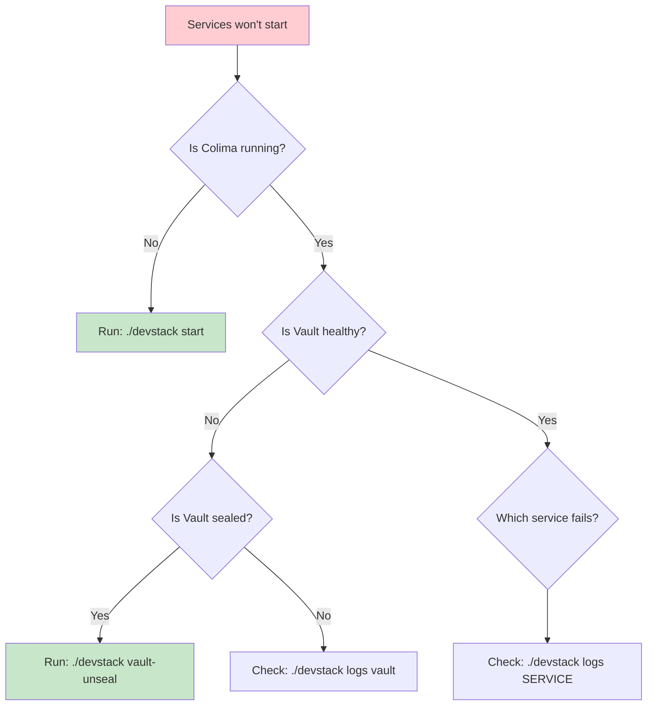
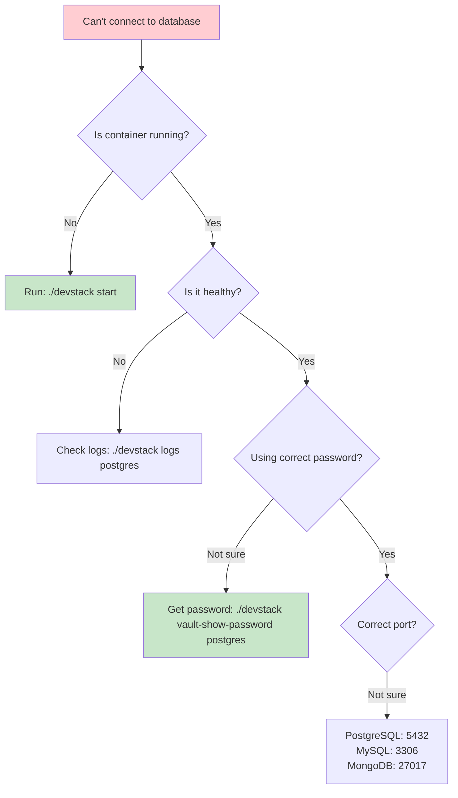
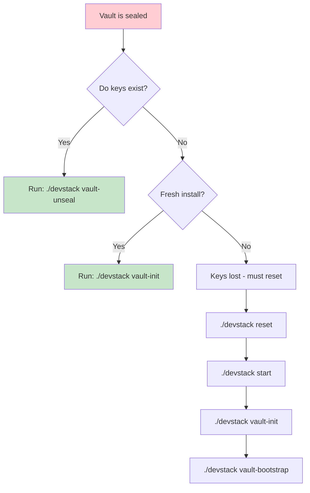
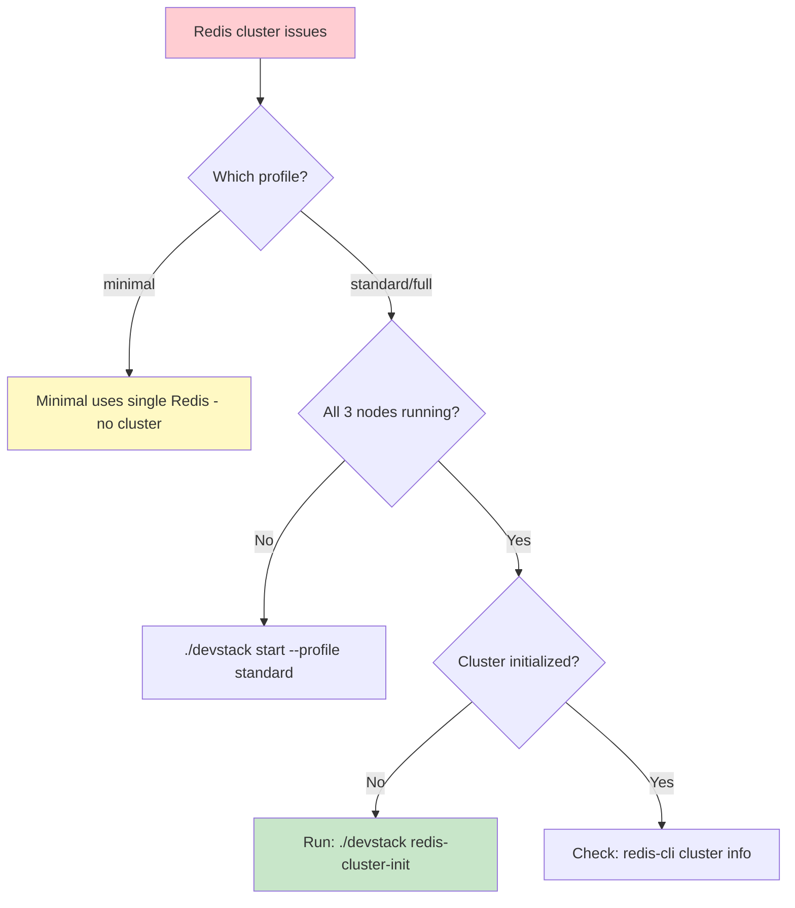
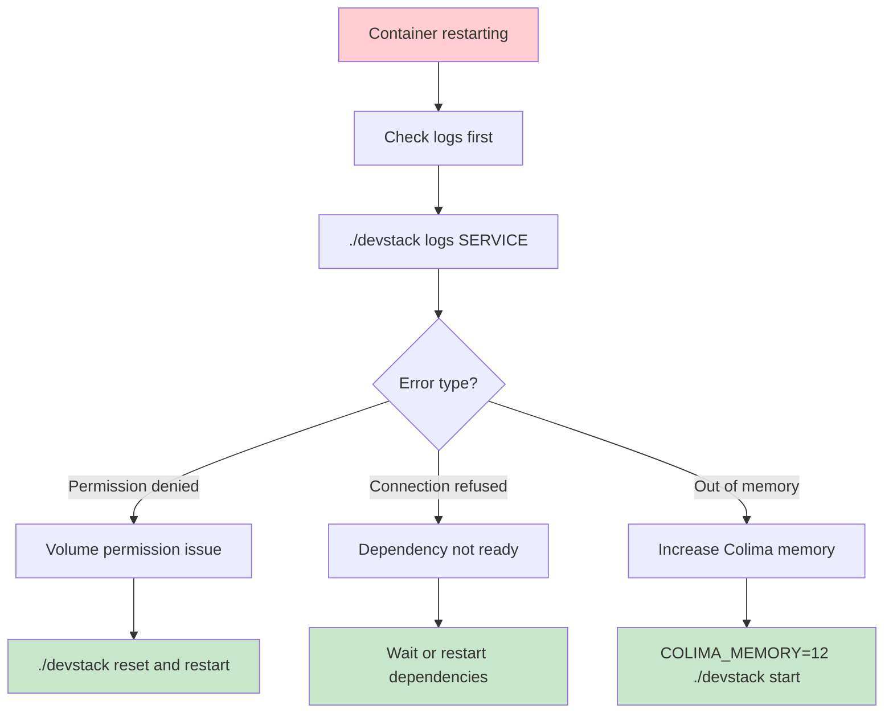
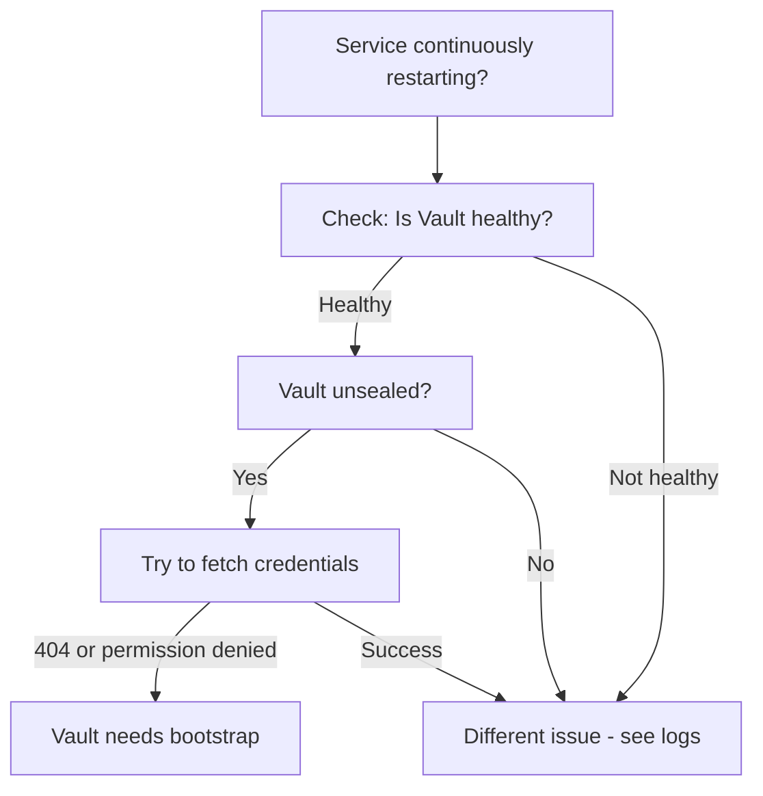
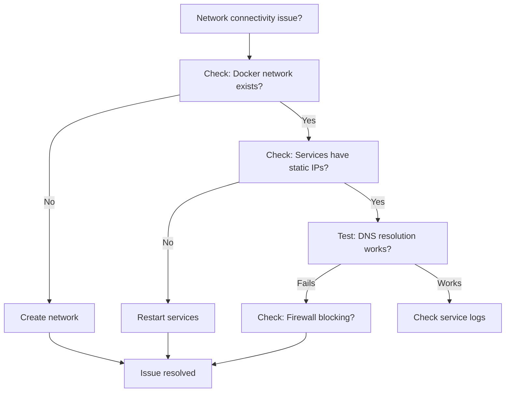

# Troubleshooting Guide

Comprehensive troubleshooting guide for common issues in the DevStack Core infrastructure.

---

## Table of Contents

1. [Service Profile Issues (NEW v1.3)](#service-profile-issues-new-v13)
2. [Startup Issues](#startup-issues)
3. [Service Health Check Failures](#service-health-check-failures)
4. [Network Connectivity Problems](#network-connectivity-problems)
5. [Database Issues](#database-issues)
6. [Redis Cluster Issues](#redis-cluster-issues)
7. [Vault Issues](#vault-issues)
8. [AppRole Authentication Issues](#approle-authentication-issues) **(NEW - Phase 1)**
9. [Docker/Colima Issues](#dockercolima-issues)
10. [Testing Failures](#testing-failures)
11. [Performance Issues](#performance-issues)
12. [TLS/Certificate Issues](#tlscertificate-issues)
13. [Diagnostic Commands](#diagnostic-commands)

---

## Visual Troubleshooting Guides

Use these focused flowcharts to quickly diagnose common issues.

### Services Won't Start



### Database Connection Failed



### Vault is Sealed



### Redis Cluster Not Working



### Container Keeps Restarting



### Quick Diagnostic Commands

```
┌─────────────────────────────────────────────────────────────┐
│  QUICK DIAGNOSTICS                                          │
├─────────────────────────────────────────────────────────────┤
│                                                             │
│  Overall status:     ./devstack health                      │
│  Service logs:       ./devstack logs SERVICE                │
│  Vault status:       ./devstack vault-status                │
│  Container status:   docker ps -a                           │
│  Resource usage:     docker stats                           │
│                                                             │
└─────────────────────────────────────────────────────────────┘
```

---

## Service Profile Issues (NEW v1.3)

### Issue: Wrong Services Starting

**Symptoms:**
```bash
# Expected 10 services (standard profile)
$ docker ps
# But seeing 18 services (full profile) or 5 services (minimal)
```

**Cause:** Profile not specified or wrong profile used

**Solution:**
```bash
# Check which services are defined for a profile
docker compose --profile standard config --services

# Stop all and restart with correct profile
docker compose down
./devstack start --profile standard

# Verify correct services running
./devstack status
```

### Issue: Redis Cluster Init Fails on Minimal Profile

**Symptoms:**
```bash
$ ./devstack redis-cluster-init
Error: redis-2 and redis-3 not found
```

**Cause:** Minimal profile only has redis-1 (standalone mode)

**Solution:**
Minimal profile uses standalone Redis, no cluster initialization needed:
```bash
# Use standard or full profile for Redis cluster
docker compose down
./devstack start --profile standard
./devstack redis-cluster-init
```

### Issue: Python Script Command Not Found

**Symptoms:**
```bash
$ ./devstack start --profile standard
ModuleNotFoundError: No module named 'click'
```

**Cause:** Python dependencies not installed

**Solution:**
```bash
# Install dependencies using uv (recommended)
uv venv
uv pip install -r scripts/requirements.txt

# The wrapper script automatically uses the venv
# No manual activation needed!

# Verify installation
python3 -c "import click, rich, yaml; print('All dependencies installed!')"

# Try again
./devstack start --profile standard
```

### Issue: Profile Environment Variables Not Taking Effect

**Symptoms:**
```bash
# Started with minimal profile but Redis cluster is enabled
$ ./devstack start --profile minimal
$ docker exec dev-redis-1 redis-cli INFO cluster | grep cluster_enabled
cluster_enabled:1  # Should be 0 for minimal
```

**Cause:** Environment variables from previous session or shell environment overriding profile

**Solution:**
```bash
# Check for conflicting env vars
env | grep REDIS

# Unset any conflicting variables
unset REDIS_CLUSTER_ENABLED

# Stop and restart with profile
docker compose down
./devstack start --profile minimal

# Verify
docker exec dev-redis-1 redis-cli INFO cluster | grep cluster_enabled
# Should show: cluster_enabled:0
```

### Issue: Cannot Combine Minimal and Standard Profiles

**Symptoms:**
```bash
$ ./devstack start --profile minimal --profile standard
# Only seeing standard services, minimal services ignored
```

**Cause:** Docker Compose uses all specified profiles, but standard includes all minimal services

**Explanation:**
- minimal ⊂ standard ⊂ full (profiles are hierarchical)
- Specifying both is redundant
- Standard profile includes all minimal services plus additional ones

**Solution:**
```bash
# Just use the larger profile
./devstack start --profile standard
```

### Issue: Missing Services After Profile Switch

**Symptoms:**
```bash
# Previously running full profile, switched to minimal
$ ./devstack start --profile minimal
# Prometheus, Grafana still showing as stopped in docker ps -a
```

**Cause:** Old containers from previous profile still exist (stopped)

**Solution:**
```bash
# Clean shutdown removes old containers
docker compose down  # Removes stopped containers
./devstack start --profile minimal

# Or remove all containers manually
docker compose down -v  # WARNING: Removes volumes too
```

### Issue: Reference Profile Services Not Starting

**Symptoms:**
```bash
$ ./devstack start --profile reference
# Reference APIs failing to start, database connection errors
```

**Cause:** Reference profile requires infrastructure services (must combine with standard/full)

**Solution:**
```bash
# Stop and restart with combined profiles
docker compose down
./devstack start --profile standard --profile reference

# Verify both profiles running
docker ps | grep -E "dev-postgres|dev-reference-api"
```

### Issue: Observability Services Not Available

**Symptoms:**
```bash
# Started with standard profile
$ curl http://localhost:9090
Connection refused
```

**Cause:** Prometheus/Grafana only included in full profile

**Solution:**
```bash
# Use full profile for observability
docker compose down
./devstack start --profile full

# Access services
curl http://localhost:9090  # Prometheus
curl http://localhost:3001  # Grafana
```

### Issue: Profile Command Help Not Working

**Symptoms:**
```bash
$ ./devstack --help
# No output or error
```

**Cause:** Script not executable or Python dependencies missing

**Solution:**
```bash
# Make script executable
chmod +x devstack

# Check she bang line
head -1 devstack
# Should be: #!/usr/bin/env python3

# Install dependencies
uv venv && uv pip install -r scripts/requirements.txt

# Try again (wrapper script auto-uses venv)
./devstack --help
```

### Issue: Script Errors with Rust CLI Tool Aliases

**Symptoms:**
```bash
# Scripts failing with unexpected errors
$ ./scripts/check-markdown-links.sh
rg: error parsing flag -E: grep config error: unknown encoding: \[([^]]+)\]\(([^)]+)\)

# Or grep/find commands behaving differently than expected
```

**Cause:** Shell has aliased standard Unix tools to Rust alternatives (e.g., `grep→rg`, `find→fd`)

**Background:**
- Modern Rust-based CLI tools (ripgrep, fd, bat, eza) are popular replacements for grep, find, cat, ls
- These tools have different syntax and command-line flags
- DevStack Core scripts explicitly use `/usr/bin/grep`, `/usr/bin/awk`, etc. to avoid conflicts
- However, some edge cases may still exist

**Verification:**
```bash
# Check what tools are aliased
which grep    # May show: grep: aliased to rg
which find    # May show: find: aliased to fd
which ls      # May show: ls: aliased to eza
which cat     # May show: cat: aliased to bat

# Check actual tool locations
/usr/bin/grep --version   # Should show: grep (BSD grep) or GNU grep
```

**Solution 1: Scripts Already Handle This (Recommended)**
All DevStack Core scripts are designed to work with Rust tool aliases:
```bash
# Scripts use full paths to avoid aliases
# No action needed - just run the script normally
./scripts/check-markdown-links.sh
./scripts/generate-certificates.sh
./tests/test-vault.sh
```

**Solution 2: Verify Script Compatibility**
If a script still fails:
```bash
# Check if script uses full paths
grep -n "grep\|find\|awk\|sed" scripts/<script-name>.sh

# Scripts should use:
# - /usr/bin/grep (not just grep)
# - /usr/bin/awk (not just awk)
# Standard paths for awk, sed (these aren't typically aliased)
```

**Solution 3: Temporary Alias Removal (Last Resort)**
```bash
# Only if a specific script fails - run without aliases
unalias grep find ls cat
./scripts/<problematic-script>.sh

# Re-alias after (add to ~/.zshrc if desired)
alias grep='rg'
alias find='fd'
# etc.
```

**Note:** Rust CLI tools are **optional** and not required for DevStack Core. See [INSTALLATION.md](./INSTALLATION.md#step-2-install-required-software) for details on optional tools.

### Diagnostic: Check Profile Configuration

```bash
# List available profiles
./devstack profiles

# Check which services are in a profile
docker compose --profile minimal config --services
docker compose --profile standard config --services
docker compose --profile full config --services

# Verify profile .env files exist
ls -la configs/profiles/*.env

# Check environment loading
set -a
source configs/profiles/standard.env
set +a
env | grep REDIS_CLUSTER_ENABLED
```

---

## Startup Issues

### Issue: Services Continuously Restarting After Fresh Start

**Symptoms:**
```bash
$ docker ps
CONTAINER ID   NAME              STATUS
abc123         dev-postgres-1    Restarting (1) 30 seconds ago
def456         dev-redis-1       Restarting (1) 25 seconds ago
```

**Logs show:**
```
Installing jq...
Installing jq...
Installing jq...
(repeating in a loop)
```

**Root Cause:** Vault is unsealed but **NOT bootstrapped** with service credentials.

**Diagnostic Flow:**



**Solution:**

1. **Verify Vault is unsealed:**
```bash
docker exec dev-vault-1 vault status
```

Expected output:
```
Sealed          false
```

2. **Check if credentials exist:**
```bash
VAULT_ADDR=http://localhost:8200 \
VAULT_TOKEN=$(cat ~/.config/vault/root-token) \
vault kv get secret/postgresql
```

If you get `404` or `permission denied`, Vault needs bootstrap.

3. **Run Vault bootstrap:**
```bash
VAULT_ADDR=http://localhost:8200 \
VAULT_TOKEN=$(cat ~/.config/vault/root-token) \
bash configs/vault/scripts/vault-bootstrap.sh
```

Expected output:
```
✓ KV secrets engine enabled
✓ Root CA created
✓ Intermediate CA created
✓ Certificate roles created (9 services)
✓ Credentials generated and stored
✓ Policies created
✓ CA certificates exported
```

4. **Restart failing services:**
```bash
docker compose restart postgres redis-1 redis-2 redis-3 mysql mongodb rabbitmq
```

5. **Verify all services are healthy:**
```bash
docker ps --format "table {{.Names}}\t{{.Status}}"
```

All services should show `Up` and `healthy` within 60 seconds.

**Prevention:**
Add automatic bootstrap check to `devstack start` (see [Future Enhancements](#future-enhancements)).

---

### Issue: Colima VM Won't Start

**Symptoms:**
```bash
$ ./devstack start
ERRO[0000] error starting vm: error creating instance
```

**Common Causes:**

1. **Insufficient disk space**
```bash
# Check available space
df -h ~

# Solution: Free up disk space or adjust COLIMA_DISK
COLIMA_DISK=100 ./devstack start
```

2. **VZ framework issue (macOS Ventura+)**
```bash
# Check Colima version
colima version

# Update Colima if outdated
brew upgrade colima

# Restart with fresh config
colima delete
./devstack start
```

3. **Port conflicts**
```bash
# Check if ports are already in use
lsof -i :8200  # Vault
lsof -i :5432  # PostgreSQL
lsof -i :3001  # Grafana

# Stop conflicting services or change ports in docker-compose.yml
```

---

### Issue: Docker Compose Services Won't Start

**Symptoms:**
```bash
$ docker compose up -d
ERROR: yaml.parser.ParserError
```

**Solutions:**

1. **YAML syntax error:**
```bash
# Validate docker-compose.yml
docker compose config

# Look for the error line and fix indentation/syntax
```

2. **Invalid environment variables:**
```bash
# Check .env file exists and has correct format
cat .env

# No spaces around = signs
# Correct:   VAR=value
# Incorrect: VAR = value
```

3. **Missing Docker network:**
```bash
# Create network manually if needed
docker network create dev-services --subnet 172.20.0.0/16
```

---

## Service Health Check Failures

### General Health Check Debugging

**Check health status:**
```bash
docker ps --format "table {{.Names}}\t{{.Status}}\t{{.Ports}}"
```

**Inspect specific service health:**
```bash
docker inspect dev-postgres-1 --format='{{json .State.Health}}' | jq
```

**View health check logs:**
```bash
docker logs dev-postgres-1 --tail 50
```

### Service-Specific Health Check Issues

#### PostgreSQL Health Check Failing

**Diagnostic:**
```bash
# Check if PostgreSQL is running
docker exec dev-postgres-1 pg_isready -U postgres

# Check if credentials were fetched
docker logs dev-postgres-1 | grep "Fetched credentials"

# Try connecting manually
docker exec -it dev-postgres-1 psql -U dev_admin -d dev_database
```

**Common fixes:**
- Vault not bootstrapped (see [Vault Bootstrap](#issue-services-continuously-restarting-after-fresh-start))
- Incorrect credentials in Vault
- Database initialization failed (check logs)

#### Redis Cluster Health Check Failing

**Diagnostic:**
```bash
# Check cluster status
docker exec dev-redis-1 redis-cli -a $(VAULT_ADDR=http://localhost:8200 VAULT_TOKEN=$(cat ~/.config/vault/root-token) vault kv get -field=password secret/redis-1) cluster info

# Check cluster nodes
docker exec dev-redis-1 redis-cli -a <password> cluster nodes
```

**Common issues:**
- Not all 3 nodes started yet (wait 30s)
- Cluster not formed (check `configs/redis/scripts/init.sh`)
- Network issue between nodes (check `docker network inspect dev-services`)

#### MySQL Health Check Failing

**Diagnostic:**
```bash
# Check if MySQL is ready
docker exec dev-mysql-1 mysqladmin ping

# Check logs
docker logs dev-mysql-1 | grep -i error

# Try connecting
docker exec -it dev-mysql-1 mysql -u dev_user -p dev_database
```

---

## Network Connectivity Problems

### Issue: Services Can't Reach Each Other

**Symptoms:**
- APIs can't connect to databases
- "Connection refused" or "Host not found" errors

**Diagnostic:**



**Solutions:**

1. **Verify Docker network:**
```bash
docker network ls | grep dev-services
docker network inspect dev-services
```

Expected: 172.20.0.0/16 subnet with all services listed.

2. **Check service IP assignments:**
```bash
docker inspect dev-vault-1 --format='{{range .NetworkSettings.Networks}}{{.IPAddress}}{{end}}'
# Should be: 172.20.0.5

docker inspect dev-postgres-1 --format='{{range .NetworkSettings.Networks}}{{.IPAddress}}{{end}}'
# Should be: 172.20.0.10
```

3. **Test DNS resolution:**
```bash
# From one container to another
docker exec dev-reference-api-1 ping -c 2 postgres
docker exec dev-reference-api-1 ping -c 2 vault
```

4. **Test connectivity:**
```bash
# Test database connectivity from API container
docker exec dev-reference-api-1 nc -zv postgres 5432
docker exec dev-reference-api-1 nc -zv redis-1 6379
```

5. **Restart network if needed:**
```bash
docker compose down
docker network rm dev-services
docker network create dev-services --subnet 172.20.0.0/16
docker compose up -d
```

---

### Issue: Can't Access Services from Host

**Symptoms:**
- `curl http://localhost:8000` fails
- `psql -h localhost -p 5432` times out

**Solutions:**

1. **Check port bindings:**
```bash
docker ps --format "table {{.Names}}\t{{.Ports}}"
```

Expected: `0.0.0.0:8000->8000/tcp` for exposed services.

2. **Verify Colima VM networking:**
```bash
colima status

# Check VZ networking is enabled
colima list
```

3. **Test with explicit IP:**
```bash
# Get Colima VM IP
colima list -j | jq -r '.[0].address'

# Try connecting to service via VM IP
curl http://<vm-ip>:8000/health
```

---

## Database Issues

### PostgreSQL Connection Errors

**Error:** `FATAL: password authentication failed`

**Solutions:**

1. **Verify credentials in Vault:**
```bash
VAULT_ADDR=http://localhost:8200 \
VAULT_TOKEN=$(cat ~/.config/vault/root-token) \
vault kv get secret/postgresql
```

2. **Check pg_hba.conf:**
```bash
docker exec dev-postgres-1 cat /var/lib/postgresql/data/pg_hba.conf
```

Should include:
```
host    all             all             172.20.0.0/16           md5
```

3. **Reset PostgreSQL:**
```bash
docker compose stop postgres
docker volume rm devstack-core_postgres_data
docker compose up -d postgres
```

---

### MySQL Connection Errors

**Error:** `Access denied for user 'dev_user'@'172.20.0.100'`

**Solutions:**

1. **Check user grants:**
```bash
docker exec dev-mysql-1 mysql -u root -p$(VAULT_ADDR=http://localhost:8200 VAULT_TOKEN=$(cat ~/.config/vault/root-token) vault kv get -field=root_password secret/mysql) -e "SELECT user,host FROM mysql.user;"
```

2. **Recreate user:**
```bash
docker exec -it dev-mysql-1 mysql -u root -p

mysql> DROP USER IF EXISTS 'dev_user'@'%';
mysql> CREATE USER 'dev_user'@'%' IDENTIFIED BY '<password_from_vault>';
mysql> GRANT ALL PRIVILEGES ON dev_database.* TO 'dev_user'@'%';
mysql> FLUSH PRIVILEGES;
```

---

### MongoDB Authentication Failed

**Error:** `Authentication failed`

**Solutions:**

1. **Verify MongoDB credentials:**
```bash
VAULT_ADDR=http://localhost:8200 \
VAULT_TOKEN=$(cat ~/.config/vault/root-token) \
vault kv get secret/mongodb
```

2. **Test connection:**
```bash
docker exec -it dev-mongodb-1 mongosh -u dev_user -p <password> --authenticationDatabase admin dev_database
```

3. **Reset MongoDB:**
```bash
docker compose stop mongodb
docker volume rm devstack-core_mongodb_data
docker compose up -d mongodb
```

---

## Redis Cluster Issues

### Issue: Redis Cluster Not Forming

**Symptoms:**
```bash
$ docker logs dev-redis-1 | grep cluster
[ERR] Node is not in cluster mode
```

**Solutions:**

1. **Check all 3 nodes are running:**
```bash
docker ps | grep redis
```

All three (redis-1, redis-2, redis-3) must be healthy.

2. **Check cluster configuration:**
```bash
docker exec dev-redis-1 redis-cli -a <password> cluster info
```

Expected:
```
cluster_state:ok
cluster_slots_assigned:16384
cluster_known_nodes:3
```

3. **Manually create cluster:**
```bash
docker exec dev-redis-1 redis-cli -a <password> --cluster create \
  172.20.0.13:6379 \
  172.20.0.16:6379 \
  172.20.0.17:6379 \
  --cluster-replicas 0
```

4. **Reset cluster:**
```bash
docker compose stop redis-1 redis-2 redis-3
docker volume rm devstack-core_redis_data_1 devstack-core_redis_data_2 devstack-core_redis_data_3
docker compose up -d redis-1 redis-2 redis-3
```

---

### Issue: Redis MOVED Errors

**Error:** `MOVED 12345 172.20.0.16:6379`

**Explanation:** This is **normal behavior** for Redis Cluster. Clients must follow redirects.

**Solutions:**

1. **Use cluster-aware client:**
```python
# Python example
from redis.cluster import RedisCluster

rc = RedisCluster(host='172.20.0.13', port=6379, password='...')
```

2. **Test cluster operations:**
```bash
docker exec dev-redis-1 redis-cli -a <password> -c
127.0.0.1:6379> SET mykey myvalue
-> Redirected to slot [14687] located at 172.20.0.16:6379
OK
```

Note the `-c` flag enables cluster mode (follows redirects).

---

## Vault Issues

### Issue: Vault is Sealed

**Symptoms:**
```bash
$ curl http://localhost:8200/v1/sys/health
{"sealed":true}
```

**Solutions:**

1. **Check Vault status:**
```bash
docker exec dev-vault-1 vault status
```

2. **Unseal Vault manually:**
```bash
docker exec dev-vault-1 vault operator unseal $(cat ~/.config/vault/unseal-key-1)
docker exec dev-vault-1 vault operator unseal $(cat ~/.config/vault/unseal-key-2)
docker exec dev-vault-1 vault operator unseal $(cat ~/.config/vault/unseal-key-3)
```

3. **Or use auto-unseal script:**
```bash
docker exec dev-vault-1 /vault/scripts/vault-auto-unseal.sh
```

4. **Restart Vault (auto-unseals on startup):**
```bash
docker compose restart vault
```

---

### Issue: Vault Token Expired

**Error:** `permission denied`

**Solutions:**

1. **Check token TTL:**
```bash
VAULT_ADDR=http://localhost:8200 \
VAULT_TOKEN=$(cat ~/.config/vault/root-token) \
vault token lookup
```

2. **Use root token:**
```bash
# Root token never expires
export VAULT_TOKEN=$(cat ~/.config/vault/root-token)
```

3. **Create new token:**
```bash
VAULT_ADDR=http://localhost:8200 \
VAULT_TOKEN=$(cat ~/.config/vault/root-token) \
vault token create -policy=admin
```

---

### Issue: Can't Read Secrets from Vault

**Error:** `* permission denied`

**Diagnostic:**
```bash
# Check if secret exists
VAULT_ADDR=http://localhost:8200 \
VAULT_TOKEN=$(cat ~/.config/vault/root-token) \
vault kv list secret/

# Try reading specific secret
vault kv get secret/postgresql
```

**Solutions:**

1. **If secret doesn't exist - run bootstrap:**
```bash
VAULT_ADDR=http://localhost:8200 \
VAULT_TOKEN=$(cat ~/.config/vault/root-token) \
bash configs/vault/scripts/vault-bootstrap.sh
```

2. **If permission denied - check policy:**
```bash
vault token lookup
# Check "policies" field includes necessary policies
```

---

## AppRole Authentication Issues

### Issue: Service Container Fails to Start with AppRole Error

**Symptoms:**
```bash
$ docker compose logs postgres
Error: AppRole credentials not found: /vault-approles/postgres/role-id
```

**Cause:** AppRole credentials not generated or not mounted properly

**Solutions:**

1. **Run vault-bootstrap to generate AppRole credentials:**
```bash
export VAULT_ADDR=http://localhost:8200
export VAULT_TOKEN=$(cat ~/.config/vault/root-token)
./devstack vault-bootstrap
```

2. **Verify AppRole credentials exist:**
```bash
ls -la ~/.config/vault/approles/postgres/
# Should show: role-id and secret-id files
```

3. **Check file permissions:**
```bash
chmod 600 ~/.config/vault/approles/postgres/secret-id
chmod 644 ~/.config/vault/approles/postgres/role-id
```

4. **Verify volume mount in docker-compose.yml:**
```yaml
volumes:
  - ${HOME}/.config/vault/approles/postgres:/vault-approles/postgres:ro
```

---

### Issue: AppRole Login Fails with "invalid role_id"

**Symptoms:**
```bash
$ docker compose logs postgres
Error: AppRole authentication failed: invalid role_id
```

**Cause:** AppRole not created in Vault or mismatched credentials

**Solutions:**

1. **Verify AppRole exists in Vault:**
```bash
export VAULT_ADDR=http://localhost:8200
export VAULT_TOKEN=$(cat ~/.config/vault/root-token)
vault list auth/approle/role
# Should show: postgres, mysql, mongodb, redis, rabbitmq, forgejo, reference-api
```

2. **Regenerate AppRole for specific service:**
```bash
./devstack vault-bootstrap
# Or manually:
vault write auth/approle/role/postgres \
  token_ttl=1h \
  token_max_ttl=4h \
  policies=postgres-policy
```

3. **Get new role-id and secret-id:**
```bash
# Get role-id
vault read auth/approle/role/postgres/role-id

# Generate new secret-id
vault write -f auth/approle/role/postgres/secret-id
```

---

### Issue: Service Token Expired

**Symptoms:**
```bash
$ docker compose logs postgres
Error: permission denied (token expired)
```

**Cause:** Service token TTL is 1 hour, may expire if service runs long-term

**Solutions:**

1. **Restart service to get new token:**
```bash
docker compose restart postgres
```

2. **Check token TTL policy:**
```bash
vault read auth/approle/role/postgres
# Look for: token_ttl and token_max_ttl
```

3. **For long-running services, consider token renewal in init script**

---

### Issue: Cross-Service Access Denied

**Symptoms:**
```bash
$ docker exec dev-postgres psql -U devuser -c "SELECT 1"
Error: Could not fetch MySQL credentials from Vault
```

**Cause:** This is **expected behavior** - each service can only access its own secrets

**Explanation:**
AppRole policies enforce least-privilege access. PostgreSQL's AppRole can only read `secret/postgres`, not `secret/mysql`.

**If you need cross-service access (NOT recommended):**
```bash
# Modify policy (development only!)
vault policy write postgres-policy - <<EOF
path "secret/data/postgres" {
  capabilities = ["read"]
}
path "secret/data/mysql" {
  capabilities = ["read"]
}
EOF
```

**Better solution:** Use service mesh or API gateway for cross-service communication.

---

### Issue: AppRole Credentials Missing After System Restart

**Symptoms:**
```bash
$ ls ~/.config/vault/approles/postgres/
ls: cannot access: No such file or directory
```

**Cause:** Vault data not persisted or vault-bootstrap not run after fresh install

**Solutions:**

1. **Check if Vault data volume exists:**
```bash
docker volume ls | grep vault
# Should show: devstack-core_vault_data
```

2. **Re-run vault-bootstrap:**
```bash
./devstack vault-init      # If Vault is uninitialized
./devstack vault-bootstrap  # Regenerate AppRole credentials
```

3. **Backup AppRole credentials (recommended):**
```bash
# Backup
tar -czf vault-approles-backup-$(date +%Y%m%d).tar.gz ~/.config/vault/approles/

# Restore
tar -xzf vault-approles-backup-YYYYMMDD.tar.gz -C ~/
```

---

### Issue: "permission denied" for Service-Specific Secret

**Symptoms:**
```bash
$ docker compose logs postgres
Error reading secret/postgres: permission denied
```

**Cause:** Service policy not attached to AppRole or policy doesn't allow read

**Solutions:**

1. **Verify policy exists:**
```bash
vault policy list
# Should include: postgres-policy
```

2. **Check policy contents:**
```bash
vault policy read postgres-policy
# Should show path "secret/data/postgres" with read capability
```

3. **Verify AppRole has policy attached:**
```bash
vault read auth/approle/role/postgres
# Check "policies" field includes "postgres-policy"
```

4. **Re-create policy and AppRole:**
```bash
./devstack vault-bootstrap
```

---

### Issue: init-approle.sh Script Not Found

**Symptoms:**
```bash
$ docker compose up postgres
Error: exec /init/init-approle.sh: no such file or directory
```

**Cause:** Volume mount missing or script doesn't exist

**Solutions:**

1. **Verify script exists:**
```bash
ls -la configs/postgres/scripts/init-approle.sh
```

2. **Check docker-compose.yml volume mount:**
```yaml
volumes:
  - ./configs/postgres/scripts/init-approle.sh:/init/init-approle.sh:ro
```

3. **Ensure script has execute permissions:**
```bash
chmod +x configs/postgres/scripts/init-approle.sh
```

---

### Debugging AppRole Authentication

**Enable debug logging:**
```bash
# In init-approle.sh, add before authentication:
set -x  # Enable debug mode

# View full authentication flow:
docker compose logs postgres 2>&1 | grep -A 10 "AppRole"
```

**Manual AppRole test:**
```bash
# Get credentials from files
ROLE_ID=$(cat ~/.config/vault/approles/postgres/role-id)
SECRET_ID=$(cat ~/.config/vault/approles/postgres/secret-id)

# Test login
curl -X POST http://localhost:8200/v1/auth/approle/login \
  -d "{\"role_id\":\"$ROLE_ID\",\"secret_id\":\"$SECRET_ID\"}"

# Should return: {"auth":{"client_token":"hvs.CAESIE..."}}
```

**Check which services use AppRole:**
```bash
# List all AppRole credentials
ls -la ~/.config/vault/approles/
# Should show: postgres, mysql, mongodb, redis, rabbitmq, forgejo, reference-api

# Services NOT using AppRole (use VAULT_TOKEN):
# - pgbouncer, api-first, golang-api, nodejs-api, rust-api
# - redis-exporter-1/2/3, vector
```

---

## Docker/Colima Issues

### Issue: Docker Daemon Not Running

**Symptoms:**
```bash
$ docker ps
Cannot connect to the Docker daemon
```

**Solutions:**

1. **Check Colima status:**
```bash
colima status
```

2. **Start Colima:**
```bash
colima start
```

Or use manage script:
```bash
./devstack start
```

3. **If stuck, force restart:**
```bash
colima stop -f
colima start
```

---

### Issue: Out of Disk Space

**Symptoms:**
```bash
$ docker system df
Images          50GB
Containers      10GB
Volumes         20GB
```

**Solutions:**

1. **Clean up unused resources:**
```bash
# Remove unused containers, networks, images
docker system prune -a

# Remove unused volumes (WARNING: deletes data!)
docker volume prune
```

2. **Remove specific volumes:**
```bash
# List volumes
docker volume ls

# Remove specific volume
docker volume rm devstack-core_prometheus_data
```

3. **Increase Colima disk:**
```bash
colima stop
# Edit ~/.colima/default/colima.yaml
# Change disk: 100G

colima start
```

---

### Issue: Slow Container Performance

**Symptoms:**
- Containers are slow
- High CPU usage

**Solutions:**

1. **Increase Colima resources:**
```bash
# Stop Colima
colima stop

# Start with more resources
COLIMA_CPU=8 COLIMA_MEMORY=16 ./devstack start
```

2. **Check resource usage:**
```bash
docker stats
```

3. **Limit individual containers:**
```yaml
# In docker-compose.yml
services:
  postgres:
    deploy:
      resources:
        limits:
          cpus: '2'
          memory: 2G
```

---

## Testing Failures

### Issue: Infrastructure Tests Failing

**Common test failures and solutions:**

1. **Test: Vault health check**
```bash
# Manual test
curl -s http://localhost:8200/v1/sys/health | jq

# Should return: "sealed": false
```

**Fix:** Unseal Vault (see [Vault is Sealed](#issue-vault-is-sealed))

2. **Test: Service connectivity**
```bash
# Manual test
docker exec dev-reference-api-1 curl -s http://postgres:5432
```

**Fix:** Check network connectivity (see [Network Issues](#network-connectivity-problems))

3. **Test: Redis cluster**
```bash
# Run specific test
bash tests/infrastructure/test_redis_cluster.sh
```

**Fix:** See [Redis Cluster Issues](#redis-cluster-issues)

---

### Issue: Python Tests Failing

**Running specific test suites:**

1. **FastAPI unit tests:**
```bash
cd reference-apps/fastapi
pytest tests/ -v
```

2. **With coverage:**
```bash
pytest tests/ --cov=app --cov-report=term-missing
```

3. **Specific test file:**
```bash
pytest tests/test_api.py::test_health_check -v
```

**Common issues:**

- **Import errors:** Check virtual environment is activated
- **Connection errors:** Ensure services are healthy
- **Credential errors:** Run Vault bootstrap

---

### Issue: Docker Build Failures - Python Dependency Conflicts

**Symptoms:**
```bash
$ docker compose build reference-api
ERROR: Cannot install -r requirements.txt (line 32) and pytest==9.0.0 because these package versions have conflicting dependencies.
The user requested pytest==9.0.0
pytest-asyncio 1.2.0 depends on pytest<9 and >=8.2

# OR

ERROR: Cannot install fastapi-cache2[redis]==0.2.2 and redis==7.0.1 because these package versions have conflicting dependencies.
fastapi-cache2[redis] 0.2.2 depends on redis<5.0.0 and >=4.2.0rc1; extra == "redis"
```

**Cause:**
- Pinned dependency versions with incompatible requirements
- `pytest-asyncio 1.2.0` incompatible with `pytest 9.0.0`
- `fastapi-cache2[redis]` extra requires `redis<5.0.0` but we need `redis 7.0.1`

**Solution (without downgrades):**

1. **Fix pytest-asyncio conflict:**
```python
# In requirements.txt, change:
pytest-asyncio==1.2.0

# To (let pip resolve compatible version):
pytest-asyncio  # Let pip resolve compatible version
```

2. **Fix fastapi-cache2 redis conflict:**
```python
# In requirements.txt, change:
fastapi-cache2[redis]==0.2.2

# To (install without redis extra):
fastapi-cache2==0.2.2  # Install without [redis] extra to avoid dependency conflict
```

3. **Rebuild Docker image:**
```bash
docker compose build reference-api
docker compose up -d reference-api
```

**Result:** Build succeeds while maintaining `pytest 9.0.0` and `redis 7.0.1`

**Reference:** Fixed in November 2025 - see `reference-apps/fastapi/requirements.txt`

---

### Issue: FastAPI /health/all Endpoint Returns 500 Error

**Symptoms:**
```bash
$ curl http://localhost:8000/health/all
{"error":"InternalServerError","message":"An unexpected error occurred","status_code":500}

# Logs show:
AssertionError: You must call init first!
```

**Cause:**
- Redis connection fails at startup (e.g., Redis not running or credentials missing)
- Startup exception handler catches Redis error but doesn't initialize FastAPICache
- `/health/all` endpoint has `@cache()` decorator
- Decorator tries to use uninitialized FastAPICache → AssertionError

**Solution:**

Add InMemoryBackend fallback in startup exception handler:

```python
# In reference-apps/fastapi/app/main.py startup event
try:
    # Try to initialize Redis cache
    redis_creds = await vault_client.get_secret("redis-1")
    redis_password = redis_creds.get("password", "")
    redis_url = f"redis://:{redis_password}@{settings.REDIS_HOST}:{settings.REDIS_PORT}"
    await cache_manager.init(redis_url, prefix="cache:")
except Exception as e:
    logger.error(f"Failed to initialize cache: {e}")
    logger.warning("Application will continue without caching")
    # Initialize FastAPICache with InMemoryBackend as fallback to prevent decorator errors
    from fastapi_cache import FastAPICache
    from fastapi_cache.backends.inmemory import InMemoryBackend
    FastAPICache.init(InMemoryBackend(), prefix="cache:")
```

**Result:** Endpoint returns 200 with "degraded" status instead of crashing

**Verification:**
```bash
# Test endpoint
curl http://localhost:8000/health/all | jq

# Should return:
{
  "status": "degraded",  # or "healthy" if all services up
  "services": { ... }
}
```

**Reference:** Fixed in November 2025 - see `reference-apps/fastapi/app/main.py:369-375`

---

### Issue: Go Tests Failing

**Running Go tests:**

```bash
cd reference-apps/golang
go test ./... -v
```

**Common issues:**

1. **Build errors:**
```bash
go mod tidy
go mod download
```

2. **Test timeout:**
```bash
go test ./... -v -timeout 5m
```

---

## Performance Issues

### Issue: Slow API Response Times

**Diagnostic:**

1. **Check API metrics:**
```bash
curl http://localhost:8000/metrics | grep http_request_duration
```

2. **Check database connection pooling:**
```bash
docker logs dev-reference-api-1 | grep "pool"
```

3. **Monitor with Grafana:**
- Open http://localhost:3001
- Check "Application Metrics" dashboard
- Look for slow queries or high latency

**Solutions:**

1. **Increase connection pool size:**
```python
# In reference-apps/fastapi/app/database.py
POOL_SIZE = 20  # Increase from default 10
```

2. **Add caching:**
```python
# Use Redis for caching
from redis import Redis
cache = Redis(host='redis-1', port=6379)
```

3. **Optimize database queries:**
```bash
# Check slow queries in PostgreSQL
docker exec dev-postgres-1 psql -U dev_admin -d dev_database -c \
  "SELECT query, calls, total_time FROM pg_stat_statements ORDER BY total_time DESC LIMIT 10;"
```

---

### Issue: High Memory Usage

**Diagnostic:**
```bash
docker stats --no-stream
```

**Solutions:**

1. **Restart high-memory services:**
```bash
docker compose restart <service>
```

2. **Add memory limits:**
```yaml
# docker-compose.yml
services:
  mongodb:
    deploy:
      resources:
        limits:
          memory: 2G
```

3. **Increase Colima memory:**
```bash
COLIMA_MEMORY=16 ./devstack start
```

---

## TLS/Certificate Issues

### Issue: Vault Certificate Issuance Fails - Common Name Not Allowed

**Symptoms:**
```bash
$ vault write pki_int/issue/postgres-role common_name="postgres" ttl=1h
Error writing data to pki_int/issue/postgres-role: Error making API request.

URL: PUT http://localhost:8200/v1/pki_int/issue/postgres-role
Code: 400. Errors:

* common name postgres not allowed by this role
```

**Cause:**
- Vault PKI role has `allowed_domains` configuration
- Common name must match one of the allowed patterns
- For postgres role: allowed domains are `postgres.dev-services.local` and `localhost`
- Using bare `postgres` doesn't match the allowed pattern

**Solution:**

Use the correct common name matching PKI role configuration:

```bash
# Check allowed domains for a role
vault read pki_int/roles/postgres-role

# Should show:
# allowed_domains: [postgres.dev-services.local, localhost]

# Issue certificate with correct common name
vault write pki_int/issue/postgres-role \
  common_name="postgres.dev-services.local" \
  ttl=1h

# OR for localhost
vault write pki_int/issue/postgres-role \
  common_name="localhost" \
  ttl=1h
```

**Common allowed domains by service:**
- **postgres**: `postgres.dev-services.local`, `localhost`
- **mysql**: `mysql.dev-services.local`, `localhost`
- **redis**: `redis.dev-services.local`, `localhost`
- **mongodb**: `mongodb.dev-services.local`, `localhost`
- **rabbitmq**: `rabbitmq.dev-services.local`, `localhost`

**Verification:**
```bash
# List all PKI roles
vault list pki_int/roles

# Check specific role configuration
vault read pki_int/roles/<service>-role
```

**Reference:** Fixed in tests/test-vault.sh:483 (November 2025)

---

### Issue: Certificate Verification Failed

**Error:** `SSL certificate problem: unable to get local issuer certificate`

**Solutions:**

1. **Check CA certificate exists:**
```bash
ls -la ~/.config/vault/ca/
# Should have: ca-chain.pem, root-ca.pem, intermediate-ca.pem
```

2. **Re-export CA certificates:**
```bash
VAULT_ADDR=http://localhost:8200 \
VAULT_TOKEN=$(cat ~/.config/vault/root-token) \
bash configs/vault/scripts/vault-bootstrap.sh
```

3. **Trust CA certificate (macOS):**
```bash
sudo security add-trusted-cert -d -r trustRoot -k /Library/Keychains/System.keychain ~/.config/vault/ca/root-ca.pem
```

4. **Use CA in API calls:**
```bash
curl --cacert ~/.config/vault/ca/ca-chain.pem https://localhost:8443/health
```

---

### Issue: TLS Handshake Timeout

**Diagnostic:**
```bash
openssl s_client -connect localhost:8443 -CAfile ~/.config/vault/ca/ca-chain.pem
```

**Solutions:**

1. **Check TLS is enabled in Vault:**
```bash
VAULT_ADDR=http://localhost:8200 \
VAULT_TOKEN=$(cat ~/.config/vault/root-token) \
vault kv get -field=tls_enabled secret/postgresql
```

2. **Verify certificate validity:**
```bash
docker exec dev-postgres-1 openssl x509 -in /etc/ssl/certs/postgres.crt -text -noout
```

3. **Regenerate certificates:**
```bash
# Re-run bootstrap
VAULT_ADDR=http://localhost:8200 \
VAULT_TOKEN=$(cat ~/.config/vault/root-token) \
bash configs/vault/scripts/vault-bootstrap.sh

# Restart service
docker compose restart postgres
```

---

## Diagnostic Commands

### Complete Health Check

Run all health checks:
```bash
bash tests/infrastructure/run_all_tests.sh
```

### Service-Specific Diagnostics

**Vault:**
```bash
docker exec dev-vault-1 vault status
docker logs dev-vault-1 --tail 50
curl http://localhost:8200/v1/sys/health | jq
```

**PostgreSQL:**
```bash
docker exec dev-postgres-1 pg_isready
docker logs dev-postgres-1 --tail 50
docker exec dev-postgres-1 psql -U dev_admin -d dev_database -c "SELECT version();"
```

**Redis Cluster:**
```bash
docker exec dev-redis-1 redis-cli -a <password> cluster info
docker exec dev-redis-1 redis-cli -a <password> cluster nodes
docker logs dev-redis-1 --tail 50
```

**MySQL:**
```bash
docker exec dev-mysql-1 mysqladmin ping
docker logs dev-mysql-1 --tail 50
docker exec dev-mysql-1 mysql -u dev_user -p<password> -e "SHOW DATABASES;"
```

**MongoDB:**
```bash
docker exec dev-mongodb-1 mongosh --eval "db.adminCommand('ping')"
docker logs dev-mongodb-1 --tail 50
```

**RabbitMQ:**
```bash
docker exec dev-rabbitmq-1 rabbitmqctl status
docker logs dev-rabbitmq-1 --tail 50
curl -u dev_user:<password> http://localhost:15672/api/overview | jq
```

### Network Diagnostics

**Check all IPs:**
```bash
docker network inspect dev-services --format='{{range .Containers}}{{.Name}}: {{.IPv4Address}}{{"\n"}}{{end}}'
```

**Test DNS resolution:**
```bash
docker exec dev-reference-api-1 nslookup vault
docker exec dev-reference-api-1 nslookup postgres
```

**Test connectivity matrix:**
```bash
for service in vault postgres mysql mongodb redis-1 rabbitmq; do
  echo "Testing $service..."
  docker exec dev-reference-api-1 nc -zv $service $(docker port dev-$service-1 | head -1 | cut -d: -f2) 2>&1 | grep -q "succeeded" && echo "✓ $service" || echo "✗ $service"
done
```

### Performance Diagnostics

**Resource usage:**
```bash
docker stats --no-stream --format "table {{.Name}}\t{{.CPUPerc}}\t{{.MemUsage}}\t{{.NetIO}}"
```

**API response time:**
```bash
time curl -s http://localhost:8000/health
```

**Database query performance:**
```bash
docker exec dev-postgres-1 psql -U dev_admin -d dev_database -c \
  "SELECT schemaname,tablename,n_tup_ins,n_tup_upd,n_tup_del FROM pg_stat_user_tables;"
```

---

## Future Enhancements

**Planned improvements to reduce troubleshooting:**

1. **Automatic Vault Bootstrap Detection**
   - Add check to `devstack start`
   - Auto-run bootstrap if credentials missing
   - Make startup truly "one command"

2. **Health Dashboard**
   - Quick status showing all 23 services
   - Vault bootstrap status indicator
   - Add to `./devstack status`

3. **Enhanced Error Messages**
   - Better service log output
   - Clearer init script errors
   - Actionable error messages

4. **Automated Recovery**
   - Auto-restart unhealthy services
   - Self-healing for common issues
   - Notification system for failures

---

## Getting Help

If you encounter an issue not covered here:

1. **Check service logs:**
   ```bash
   docker logs <container-name> --tail 100
   ```

2. **Run diagnostic tests:**
   ```bash
   bash tests/infrastructure/run_all_tests.sh
   ```

3. **Check GitHub Issues:**
   - See if similar issue already reported
   - Open new issue with logs and diagnostics

4. **Consult related documentation:**
   - [ARCHITECTURE.md](./ARCHITECTURE.md) - System design
   - [PERFORMANCE_TUNING.md](./PERFORMANCE_TUNING.md) - Optimization
   - [VAULT_SECURITY.md](./VAULT_SECURITY.md) - Vault specifics
   - [TEST_VALIDATION_REPORT.md](./TEST_VALIDATION_REPORT.md) - Expected test behavior

---

*Last updated: 2025-10-27*
