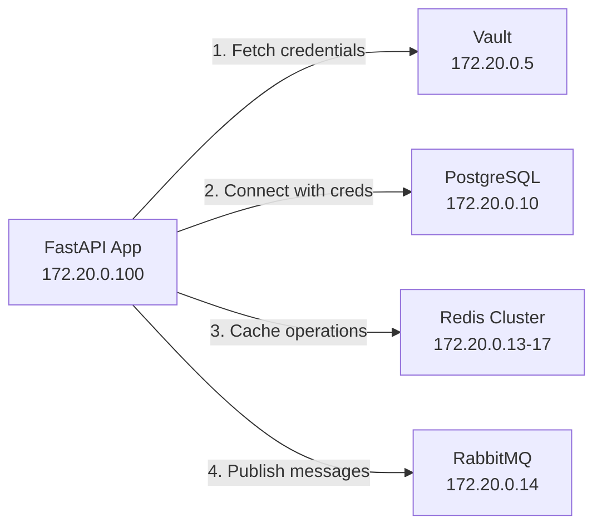

# Network Architecture

Comprehensive guide to the Docker network configuration, IP assignments, and service-to-service communication in the DevStack Core infrastructure.

---

## Table of Contents

1. [Overview](#overview)
2. [Docker Network Configuration](#docker-network-configuration)
3. [Static IP Assignments](#static-ip-assignments)
4. [Service-to-Service Communication](#service-to-service-communication)
5. [Port Mappings](#port-mappings)
6. [Network Isolation](#network-isolation)
7. [DNS Resolution](#dns-resolution)
8. [Network Troubleshooting](#network-troubleshooting)
9. [Security Considerations](#security-considerations)
10. [Related Documentation](#related-documentation)

---

## Overview

The DevStack Core infrastructure uses a **single Docker bridge network** with static IP assignments for predictable, reliable service communication. All 28+ containers run within this isolated network, communicating via DNS service names and internal IPs.

### Key Architecture Principles

- **Single Bridge Network**: All services share the `dev-services` network
- **Static IP Assignments**: Each service has a predictable, fixed IP address
- **Docker DNS**: Services resolve each other by container name
- **Selective Port Exposure**: Only necessary ports are mapped to the host
- **Network Isolation**: No host network mode - all services use bridge networking

---

## Docker Network Configuration

### Network Specifications

**Network Name:** `dev-services`
**Type:** Bridge network
**Subnet:** `172.20.0.0/16`
**Gateway:** `172.20.0.1`
**IP Range:** `172.20.0.2` - `172.20.255.254`

### Network Creation

The network is automatically created by Docker Compose on first start:

```yaml
networks:
  dev-services:
    driver: bridge
    ipam:
      config:
        - subnet: 172.20.0.0/16
```

### Why Bridge Networking?

**Advantages:**
- ✅ **Isolation** - Services isolated from host network
- ✅ **DNS** - Built-in DNS resolution between containers
- ✅ **Port Control** - Explicit port mapping to host
- ✅ **Security** - No direct access to host network
- ✅ **Portability** - Works consistently across different hosts

**Alternative (Not Used):**
- ❌ **Host Network Mode** - No isolation, potential port conflicts
- ❌ **Overlay Network** - Unnecessary complexity for single-host setup

### Verifying Network Configuration

```bash
# List all Docker networks
docker network ls

# Inspect dev-services network
docker network inspect dev-services

# View network with formatted output
docker network inspect dev-services --format='{{json .IPAM.Config}}' | jq
```

Expected output:
```json
[
  {
    "Subnet": "172.20.0.0/16"
  }
]
```

---

## Static IP Assignments

All services have **static IP addresses** defined in `docker-compose.yml` for predictable networking.

### Core Infrastructure Services

| Service | IP Address | Container Name | Purpose |
|---------|------------|----------------|---------|
| **Vault** | 172.20.0.5 | dev-vault | Secrets management & PKI |
| **PostgreSQL** | 172.20.0.10 | dev-postgres | Primary database |
| **PgBouncer** | 172.20.0.11 | dev-pgbouncer | PostgreSQL connection pooler |
| **MySQL** | 172.20.0.12 | dev-mysql | Legacy database |
| **Redis-1** | 172.20.0.13 | dev-redis-1 | Redis cluster node 1 |
| **RabbitMQ** | 172.20.0.14 | dev-rabbitmq | Message queue |
| **MongoDB** | 172.20.0.15 | dev-mongodb | NoSQL database |
| **Redis-2** | 172.20.0.16 | dev-redis-2 | Redis cluster node 2 |
| **Redis-3** | 172.20.0.17 | dev-redis-3 | Redis cluster node 3 |

### Application Services

| Service | IP Address | Container Name | Purpose |
|---------|------------|----------------|---------|
| **Forgejo** | 172.20.0.20 | dev-forgejo | Self-hosted Git server |
| **FastAPI (Code-First)** | 172.20.0.100 | dev-reference-api | Python reference app |
| **FastAPI (API-First)** | 172.20.0.101 | dev-api-first | Python API-first reference |
| **Go API** | 172.20.0.102 | dev-golang-api | Go reference implementation |
| **Node.js API** | 172.20.0.103 | dev-nodejs-api | Node.js reference app |
| **Rust API** | 172.20.0.104 | dev-rust-api | Rust reference implementation |

### Observability Stack

| Service | IP Address | Container Name | Purpose |
|---------|------------|----------------|---------|
| **Prometheus** | 172.20.0.200 | dev-prometheus | Metrics collection |
| **Grafana** | 172.20.0.201 | dev-grafana | Visualization dashboards |
| **Loki** | 172.20.0.202 | dev-loki | Log aggregation |
| **Promtail** | 172.20.0.203 | dev-promtail | Log shipping |
| **Vector** | 172.20.0.204 | dev-vector | Observability pipeline |
| **cAdvisor** | 172.20.0.205 | dev-cadvisor | Container metrics |
| **Redis Exporter 1** | 172.20.0.206 | dev-redis-exporter-1 | Redis metrics (node 1) |
| **Redis Exporter 2** | 172.20.0.207 | dev-redis-exporter-2 | Redis metrics (node 2) |
| **Redis Exporter 3** | 172.20.0.208 | dev-redis-exporter-3 | Redis metrics (node 3) |

### Configuring Static IPs

In `docker-compose.yml`, each service specifies its static IP:

```yaml
services:
  vault:
    networks:
      dev-services:
        ipv4_address: 172.20.0.5
    # ...

  postgres:
    networks:
      dev-services:
        ipv4_address: 172.20.0.10
    # ...
```

### Checking Service IPs

```bash
# Get IP for specific service
docker inspect dev-postgres --format='{{range .NetworkSettings.Networks}}{{.IPAddress}}{{end}}'

# List all service IPs
docker network inspect dev-services --format='{{range .Containers}}{{.Name}}: {{.IPv4Address}}{{"\n"}}{{end}}'

# Formatted output with jq
docker network inspect dev-services | jq -r '.[0].Containers | to_entries[] | "\(.value.Name): \(.value.IPv4Address)"'
```

---

## Service-to-Service Communication

### Internal Communication Patterns

Services communicate with each other **using Docker DNS** - container names resolve to static IPs.

#### Example: FastAPI → PostgreSQL

```python
# In application code
DATABASE_HOST = "postgres"  # Resolves to 172.20.0.10
DATABASE_PORT = 5432

# Connection string
conn_string = f"postgresql://{user}:{password}@{DATABASE_HOST}:{DATABASE_PORT}/{database}"
```

#### Example: Application → Vault

```bash
# Inside any container
VAULT_ADDR=http://vault:8200  # Resolves to 172.20.0.5

# Fetch secret
curl -s -H "X-Vault-Token: $VAULT_TOKEN" \
  http://vault:8200/v1/secret/data/postgres
```

#### Example: Redis Cluster Communication

```python
# Redis cluster nodes communicate via static IPs
startup_nodes = [
    {"host": "redis-1", "port": 6379},  # Resolves to 172.20.0.13
    {"host": "redis-2", "port": 6379},  # Resolves to 172.20.0.16
    {"host": "redis-3", "port": 6379},  # Resolves to 172.20.0.17
]
```

### Communication Flow



### Testing Service Communication

```bash
# From host: Test if service is reachable
docker exec dev-reference-api ping -c 2 postgres

# From host: Test port connectivity
docker exec dev-reference-api nc -zv postgres 5432

# From host: Test DNS resolution
docker exec dev-reference-api nslookup vault

# Test HTTP connectivity
docker exec dev-reference-api curl -s http://vault:8200/v1/sys/health
```

---

## Port Mappings

### Port Exposure Strategy

Only ports that need to be accessible from the **host machine** are exposed. Internal-only services do not expose ports.

### Exposed Services (Host Access)

#### Databases

| Service | Internal Port | Host Port | Protocol |
|---------|---------------|-----------|----------|
| PostgreSQL | 5432 | 5432 | TCP |
| PgBouncer | 6432 | 6432 | TCP |
| MySQL | 3306 | 3306 | TCP |
| MongoDB | 27017 | 27017 | TCP |
| Redis-1 | 6379 | 6379 | TCP |
| Redis-2 | 6379 | 6380 | TCP |
| Redis-3 | 6379 | 6381 | TCP |

#### Web UIs & APIs

| Service | Internal Port | Host Port | Protocol | URL |
|---------|---------------|-----------|----------|-----|
| Vault UI | 8200 | 8200 | HTTP | http://localhost:8200 |
| Grafana | 3001 | 3001 | HTTP | http://localhost:3001 |
| Prometheus | 9090 | 9090 | HTTP | http://localhost:9090 |
| Loki | 3100 | 3100 | HTTP | http://localhost:3100 |
| RabbitMQ UI | 15672 | 15672 | HTTP | http://localhost:15672 |
| Forgejo Web | 3000 | 3000 | HTTP | http://localhost:3000 |
| Forgejo SSH | 22 | 2222 | SSH | ssh://git@localhost:2222 |

#### Reference APIs

| Service | HTTP Port | HTTPS Port | Purpose |
|---------|-----------|------------|---------|
| FastAPI (Code-First) | 8000 | 8443 | Python reference |
| FastAPI (API-First) | 8001 | 8444 | Python API-first |
| Go API | 8002 | 8445 | Go reference |
| Node.js API | 8003 | 8446 | Node.js reference |
| Rust API | 8004 | 8447 | Rust reference |

### Internal-Only Services

These services are **NOT exposed** to the host:

- **Promtail** - Log collector (internal use)
- **Vector** - Observability pipeline
- **cAdvisor** - Container metrics
- **Redis Exporters** - Metrics endpoints (scraped by Prometheus internally)

### Port Mapping Configuration

In `docker-compose.yml`:

```yaml
services:
  postgres:
    ports:
      - "5432:5432"  # host:container
    # ...

  reference-api:
    ports:
      - "8000:8000"   # HTTP
      - "8443:8443"   # HTTPS
    # ...
```

### Checking Port Mappings

```bash
# List all port mappings
docker ps --format "table {{.Names}}\t{{.Ports}}"

# Check specific service ports
docker port dev-postgres

# Verify port is listening on host
lsof -i :5432
nc -zv localhost 5432
```

---

## Network Isolation

### Container-to-Container Isolation

All services run in the **same bridge network**, allowing them to communicate. However, you can add network policies if needed.

### Host Isolation

Services **cannot** directly access:
- Host filesystem (except via mounted volumes)
- Host network services (unless explicitly exposed)
- Other Docker networks

Services **can** access:
- Other containers in `dev-services` network
- External internet (for package downloads, etc.)

### Firewall Considerations

**macOS Firewall:**
```bash
# Check if firewall is blocking Docker
/usr/libexec/ApplicationFirewall/socketfilterfw --getglobalstate

# Allow Docker (if needed)
sudo /usr/libexec/ApplicationFirewall/socketfilterfw --add /Applications/Docker.app
```

**Network Address Translation (NAT):**
- Colima VM uses NAT to share host's internet connection
- Containers use Docker's NAT for outbound connections
- Port mappings create inbound NAT rules

---

## DNS Resolution

### Docker Embedded DNS

Docker provides automatic DNS resolution for container names within the same network.

**How it works:**
1. Container queries `postgres`
2. Docker DNS server (127.0.0.11) receives query
3. DNS server looks up `postgres` in `dev-services` network
4. Returns `172.20.0.10`
5. Connection established

### DNS Resolution Examples

```bash
# Inside any container
$ nslookup vault
Server:         127.0.0.11
Address:        127.0.0.11#53

Name:   vault
Address: 172.20.0.5

$ nslookup postgres
Server:         127.0.0.11
Address:        127.0.0.11#53

Name:   postgres
Address: 172.20.0.10
```

### DNS Configuration

Docker automatically configures DNS:
- **DNS Server:** 127.0.0.11 (Docker embedded DNS)
- **Search Domain:** None (use full container names)
- **Resolution:** Container name → Static IP

### Custom DNS Hostnames

You can add DNS aliases:

```yaml
services:
  postgres:
    networks:
      dev-services:
        ipv4_address: 172.20.0.10
        aliases:
          - database
          - db
```

Now `database` and `db` also resolve to `172.20.0.10`.

### Testing DNS

```bash
# From inside a container
docker exec dev-reference-api nslookup postgres
docker exec dev-reference-api dig vault
docker exec dev-reference-api host redis-1

# Test resolution from different containers
docker exec dev-golang-api nslookup postgres
docker exec dev-nodejs-api nslookup vault
```

---

## Network Troubleshooting

### Common Issues and Solutions

#### Issue: Container Can't Resolve Other Services

**Symptoms:**
```bash
curl: (6) Could not resolve host: postgres
```

**Diagnostic:**
```bash
# Check DNS resolution
docker exec dev-reference-api nslookup postgres

# Check network membership
docker inspect dev-reference-api --format='{{json .NetworkSettings.Networks}}' | jq
```

**Solutions:**
1. Verify service is on the same network
2. Restart container: `docker restart dev-reference-api`
3. Check service is running: `docker ps | grep postgres`

#### Issue: Connection Refused

**Symptoms:**
```bash
curl: (7) Failed to connect to postgres port 5432: Connection refused
```

**Diagnostic:**
```bash
# Check if service is listening
docker exec dev-postgres ss -tlnp | grep 5432

# Check if service is healthy
docker ps --filter name=postgres
```

**Solutions:**
1. Wait for service to be healthy (check health checks)
2. Verify port is correct (5432 for PostgreSQL)
3. Check service logs: `docker logs dev-postgres`

#### Issue: Port Already in Use

**Symptoms:**
```bash
Error starting userland proxy: listen tcp4 0.0.0.0:5432: bind: address already in use
```

**Diagnostic:**
```bash
# Find process using the port
lsof -i :5432
netstat -anv | grep 5432
```

**Solutions:**
```bash
# Option 1: Stop conflicting service
brew services stop postgresql

# Option 2: Change port mapping in docker-compose.yml
ports:
  - "5433:5432"  # Use different host port
```

#### Issue: Network Not Found

**Symptoms:**
```bash
network dev-services not found
```

**Solutions:**
```bash
# Recreate network
docker network create dev-services --subnet 172.20.0.0/16

# Or restart Docker Compose
docker compose down
docker compose up -d
```

### Network Diagnostic Commands

```bash
# List all networks
docker network ls

# Inspect network
docker network inspect dev-services

# Check container network settings
docker inspect <container> --format='{{json .NetworkSettings}}' | jq

# Test connectivity between containers
docker exec <container-a> ping -c 2 <container-b>
docker exec <container-a> nc -zv <container-b> <port>

# Check routing
docker exec <container> ip route

# Check network interfaces
docker exec <container> ip addr
```

### Performance Testing

```bash
# Test latency between containers
docker exec dev-reference-api ping -c 10 postgres

# Test bandwidth (using iperf3)
# Start server in one container
docker exec -d dev-postgres iperf3 -s

# Run client in another
docker exec dev-reference-api iperf3 -c postgres -t 10
```

---

## Security Considerations

### Network Security Best Practices

**What We Do:**
- ✅ Use bridge networking (isolated from host)
- ✅ Static IPs for predictability
- ✅ Selective port exposure
- ✅ No host network mode

**For Production (Not in Dev Environment):**
- 🔒 Implement network policies (firewalls between services)
- 🔒 Use Docker secrets instead of environment variables
- 🔒 Enable TLS for all service-to-service communication
- 🔒 Segment services into multiple networks (frontend, backend, data)
- 🔒 Use service mesh (Istio, Linkerd) for mTLS

### Network Segmentation Example (Production)

```yaml
networks:
  frontend:
    driver: bridge
  backend:
    driver: bridge
  database:
    driver: bridge
    internal: true  # No external access

services:
  web:
    networks:
      - frontend
      - backend

  api:
    networks:
      - backend
      - database

  postgres:
    networks:
      - database  # Only accessible from backend
```

### Firewall Rules (Production Example)

```bash
# Allow only specific container-to-container communication
iptables -A DOCKER-USER -s 172.20.0.100 -d 172.20.0.10 -p tcp --dport 5432 -j ACCEPT
iptables -A DOCKER-USER -j DROP
```

---

## Related Documentation

- **[Vault Integration](./Vault-Integration.md)** - How services fetch credentials
- **[Service Configuration](./Service-Configuration.md)** - Configuring individual services
- **[Testing Guide](./Testing-Guide.md)** - Network connectivity tests
- **[Architecture Overview](./Architecture-Overview.md)** - Complete system architecture
- **[Health Monitoring](./Health-Monitoring.md)** - Service health checks
- **[Troubleshooting](./Common-Issues.md)** - General troubleshooting guide

---

## Summary

The network architecture provides:
- **Predictable networking** with static IP assignments
- **Easy service discovery** via Docker DNS
- **Isolation and security** with bridge networking
- **Selective exposure** of services to the host
- **Simple troubleshooting** with standard Docker commands

All services communicate internally via container names that resolve to static IPs, while only necessary services are exposed to the host machine.
